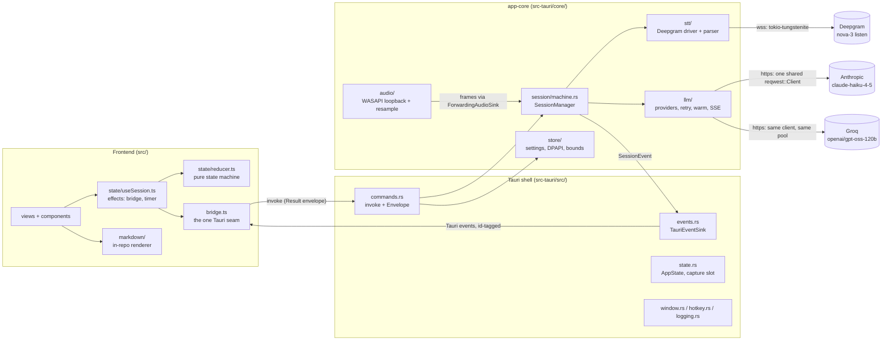
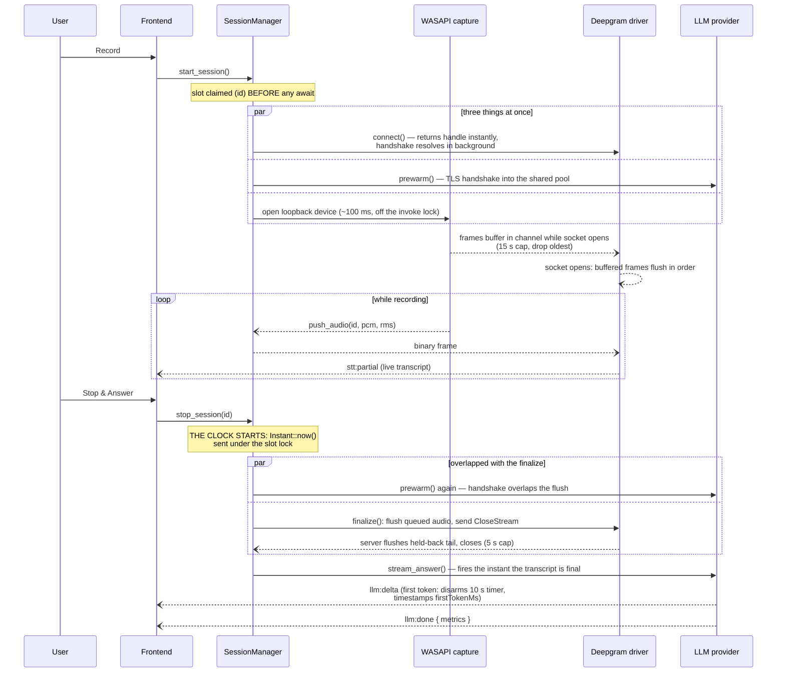
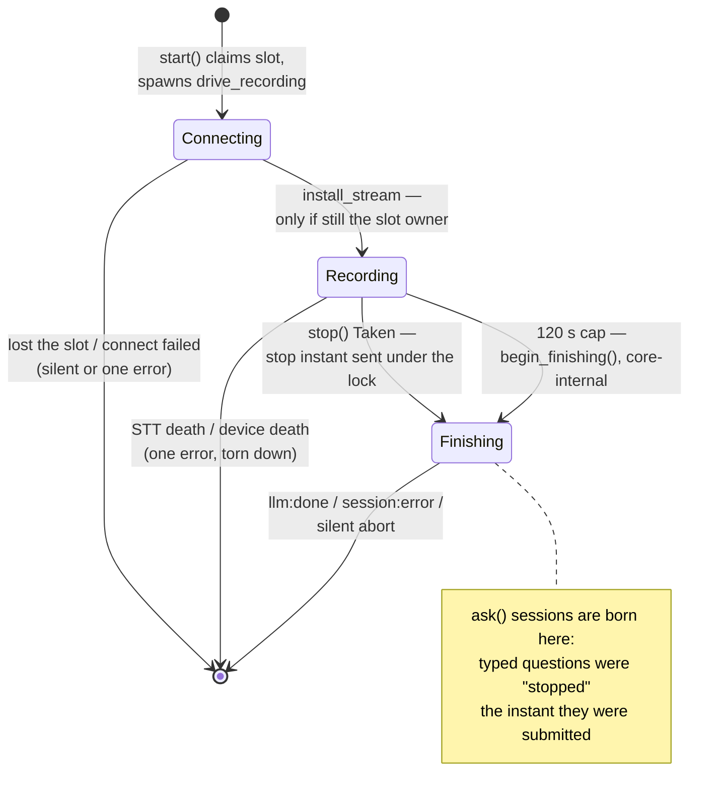
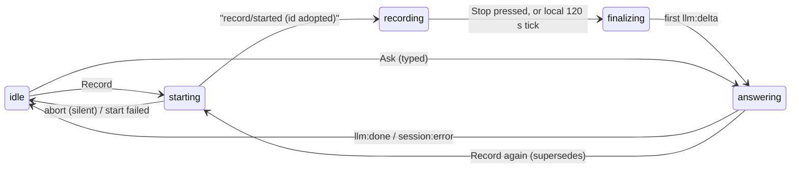

# Architecture

How the code delivers the contract in [SPEC.md](SPEC.md). The spec says *what*
must be true and cites the bug that made each rule; this document says *where*
each rule lives and *why the mechanism is shaped the way it is*. Every claim
below is checkable against a file and, where it matters, a line.

The one number that shaped everything: **stop-to-first-word of roughly one
second** (§1). Every structural decision here is either protecting that number
or making being fast safe.

---

## 1. The system at a glance

Three layers, two crates, one process:

- **`app-core`** (`src-tauri/core/`) — the entire pipeline: capture,
  resampling, the Deepgram WebSocket, the LLM HTTP streaming, the session
  state machine, settings/secrets. It knows nothing about Tauri; every
  external dependency enters through a trait (`SttConnector`/`SttStream`,
  `LlmProvider`/`LlmSink`, `AudioCapture`/`AudioSink`, `EventSink`), which is
  why `cargo test -p app-core` runs 233 tests with no network and no device.
- **Tauri shell** (`src-tauri/src/`) — exactly the glue: IPC envelopes, event
  emission, window lifecycle, hotkey, crash log
  (`src-tauri/src/lib.rs:1-5`). 34 tests cover its pure seams.
- **React frontend** (`src/`) — a thin view. All decisions live in a pure
  reducer (`src/state/reducer.ts`); the only Tauri contact point is one
  `Bridge` object (`src/bridge.ts:1-5`). 290 test cases.

The two provider wires are deliberately asymmetric in ownership:

- The **Deepgram wire** is owned by a single background task per stream
  (`src-tauri/core/src/stt/deepgram.rs:1-12`) — one owner means one
  classification site for every failure.
- The **LLM wire** is owned by whichever session is answering, but always
  through the process-wide `shared_client()`
  (`src-tauri/core/src/llm/http.rs:35`), because the connection pool inside
  that client is what pre-warming warms (§6.4).

Crossing rules at the boundaries:

- Frontend → core: commands return `{ok:true,value}|{ok:false,error}` — both
  outcomes travel the resolve lane, so a *rejected* invoke can only mean the
  shell itself broke (`src-tauri/src/commands.rs:1-4`,
  `src/bridge.ts:28-42`).
- Core → frontend: every event carries `sessionId`, and the frontend drops
  anything not belonging to the session it currently tracks
  (`src/state/reducer.ts:157-160`). This one mechanism is what makes
  supersession safe end to end (§4).
- Key material never crosses: `SettingsView` carries only
  `hasDeepgramKey`-style booleans (§8).

---

## 2. The latency pipeline: Record → Stop → first word

The design principle is that **nothing serializable is serialized**. Every
piece of setup that could sit inside the stop-to-first-word window is instead
overlapped with a phase the user cannot perceive.

What overlaps what, and where:

- **Record press.** `SessionManager::start` claims the slot and returns the
  id before any network round-trip
  (`src-tauri/core/src/session/machine.rs:210-237`), then spawns the driver.
  The Deepgram connector also returns its stream handle *before* the
  handshake resolves (`src-tauri/core/src/stt/deepgram.rs:100-105`), so
  capture starts the instant the user clicks. First words land while the
  socket is opening; they buffer in the audio channel and flush at open in
  order, capped at ~15 s with oldest-dropped — the newest audio is the speech
  the user is asking about, and it is the connect that is slow, not the
  speech that is wrong (`deepgram.rs:47-51`, `deepgram.rs:228-246`).
- **Prewarm at Record.** The TLS+TCP handshake to the answer origin overlaps
  the whole recording (`machine.rs:229-231`, plus a second one in
  `src-tauri/src/commands.rs:133-135`), so by Stop the pool holds a live
  connection.
- **Stop press.** The stop *instant* is captured where the request lands —
  inside the slot lock, sent over a oneshot to the driver
  (`machine.rs:250-256`) — so the driver can never observe `Finishing`
  without the timestamp, and metrics never depend on when a task happens to
  resume. `stop()` prewarms again *before* returning
  (`machine.rs:261-267`): the handshake refresh overlaps the STT flush
  instead of landing inside the latency window.
- **The finalize.** The drain flushes audio still queued at stop (the final
  words of the question), sends `CloseStream`, and reads the server's
  held-back tail until its close (`deepgram.rs:334-398`). §6.1's deliberate
  omission of `endpointing`/`no_delay` lives here as a pinned test: this
  client stops when the user clicks, never when an endpointer speaks, so
  those knobs only cost smart_format quality (`deepgram.rs:33-37`).
- **The answer.** `run_answer` fires the moment the transcript is final
  (`machine.rs:659-671`). The first delta both timestamps `firstTokenMs` and
  disarms the 10 s first-token timer (`machine.rs:449-466`,
  `machine.rs:708-716`). Deltas are pushed to the sink the moment they are
  decoded, never batched (`src-tauri/core/src/llm/anthropic.rs`, `apply_event`).

All limits live in one place — `src-tauri/core/src/session/mod.rs:130-146`:
STT connect 5 s, STT finalize 5 s, LLM first token 10 s, LLM total 60 s,
recording cap 120 s. All are enforced in the core so the frontend cannot
drift.

Metric honesty rules (§3) are enforced in `Metrics::finish`
(`session/mod.rs:43-49`): a provider that returns a full answer without ever
streaming a delta reports `firstTokenMs = totalMs`, never 0 — 0 renders as
"instant" and lies about the one number the app is judged on. Typed questions
report `sttFinalizeMs: 0` because there was no STT stage
(`machine.rs:311-321`).

---

## 3. The session state machine

`src-tauri/core/src/session/machine.rs` — the crown jewels (§5). One live
pipeline at a time, encoded as `Mutex<Option<Active>>` rather than a map
(`machine.rs:36-41`): the slot *type* makes supersession impossible to forget
on any path.

### The core's three phases

The phase lives inside the slot's lock, never in the driver task — the driver
learns about transitions strictly after they happened (`machine.rs:50-59`).

### The eleven invariants and their mechanisms

| § | Invariant | Mechanism | Where |
|---|---|---|---|
| 5.1 | Supersession: start/ask aborts the active session; its late events — including its `done`, including the socket death our abort caused — are dropped | `Inner::replace` swaps the slot, then `teardown()` kills the **gate first**, then cancels, then aborts the stream — so nothing the teardown itself provokes can reach the UI. `complete()` re-checks slot ownership before emitting `done` | `machine.rs:109-117`, `machine.rs:189-194` |
| 5.2 | Latest-start-wins: a slow connect that resolves after losing must not install itself | The id is claimed **before** the connect await; `install_stream` is keyed by id + `Connecting` phase, and a loser gets `false` and aborts its own stream, silently. The same rule is re-applied at the shell for the capture swap via `is_active()` | `machine.rs:131-140`, `machine.rs:517-523`, `src-tauri/src/commands.rs:156-169` |
| 5.3 | Stop contract: took / not-took, and NotTaken emits nothing | `stop()` only takes in `Recording` phase; every other case returns `NotTaken` without touching anything. The shell converts NotTaken into an error envelope — the one channel that can tell the UI nothing is coming | `machine.rs:243-270`, `commands.rs:188-209` |
| 5.4 | Audio routing: frames only for the live, not-yet-stopped session | `push_audio` matches id **and** `Phase::Recording`; post-stop and stale-id frames vanish (they would race the CloseStream flush) | `machine.rs:392-411` |
| 5.5 | One honest `stt_error` for a mid-recording/mid-finalize death; a *late* death must not kill a streaming answer | Mid-stream: error → abort → `fail()`. During finalize, a `biased` select polls the STT channel **before** the finalize future, so a death that queues its error and resolves the finalize with truncated text in the same instant always loses to the error. After finalize: `drop(rx)` makes a late socket close structurally unreachable | `machine.rs:550-556`, `machine.rs:593-619`, `machine.rs:646-649` |
| 5.6 | One error per stream, never after abort; pre-registration errors are queued | `SessionSttSink.errored: AtomicBool` enforces at-most-once even against a misbehaving stream; the unbounded channel queues an error fired inside `connect()` itself until the driver listens. `Inner::fail` takes slot ownership exactly once and never emits `aborted` | `machine.rs:422-445`, `machine.rs:171-183` |
| 5.7 | Empty transcript → `no_speech`, never an LLM call on an empty prompt | Trim-and-check after finalize, canonical message pinned as a constant | `machine.rs:651-657`, `core/src/error.rs:99` |
| 5.8 | Ask validates before superseding; typed and spoken questions share one event shape | Validation runs before `replace()`; the session is born in `Finishing`; the trimmed question replays as one final `stt:partial`; `sttFinalizeMs` is 0 | `machine.rs:277-324` |
| 5.9 | Timeout interplay; nothing paints after an error | Deadlines are `stopped_at + limit` (`sleep_until`), so the clock is the stop instant, not task-resume time. The first delta disarms the first-token arm; on any timeout `fail()` kills the gate **before** emitting, so racing deltas are suppressed | `machine.rs:695-741`, `machine.rs:179-181`, `machine.rs:457-465` |
| 5.10 | Cancel is silent | `cancel()` takes the slot and runs `teardown()` — no done, no error; stale ids are a no-op | `machine.rs:326-339` |
| 5.11 | Slot released exactly once, on every outcome | Every terminal path funnels through `release_if_current`, keyed by id — a second call, or a call after supersession already emptied the slot, is a no-op | `machine.rs:155-168` |

Device deaths get §5.5's treatment applied to audio:
`SessionManager::device_error` is phase-aware — fatal while `Connecting` or
`Recording`, ignored once `Finishing`, because a capture death after stop must
not kill an answer that is already streaming (`machine.rs:352-390`). The shell
routes device errors *through* the machine rather than emitting directly,
precisely to inherit phase-awareness, once-only, and stale-id dropping
(`src-tauri/src/state.rs:63-70`).

### The frontend machine, and how the two relate

`src/state/reducer.ts` runs `idle → starting → recording → finalizing →
answering → idle` (§9) as a pure reducer; `src/state/useSession.ts` only
decides *when* to dispatch.

The mapping is deliberately loose — the core is authoritative, the frontend
follows:

- **Adoption.** `activeId` is null while `start_session`/`ask` is in flight;
  every event is dropped until the invoke resolves and the id is adopted
  (`reducer.ts:42-51`). A resolution arriving for a superseded attempt is
  detected by `attemptRef` key mismatch and the orphan session is cancelled,
  never adopted (`useSession.ts:44-71`).
- **The stop race.** The Stop button and the global hotkey can fire in the
  same tick; `stopIssuedFor` ensures the core sees exactly one stop
  (`useSession.ts:50-93`). A rejected stop (NotTaken) tears down locally —
  waiting in "Finalizing…" would hang forever (`reducer.ts:216-221`).
- **The 120 s cap.** The core's `MAX_RECORDING` timer is armed when recording
  starts (`machine.rs:526`) and, on firing, behaves exactly like a user stop:
  `begin_finishing()`, prewarm, answer normally — *emitting no event for the
  auto-stop itself* (`machine.rs:559-584`). The frontend's wall-clock tick
  (WebView2 throttles timers in background windows, so the clock counts
  `performance.now()` deltas, not fires — `useSession.ts:181-197`) crosses
  the cap strictly later, flips to `finalizing` **locally**, keeps
  `activeId`, and issues no stop — because that stop would come back "not
  taken", and tearing down on the refusal is the double-stop race that used
  to drop every capped recording's answer (`reducer.ts:260-277`). As belt and
  braces, `llm:delta`/`llm:done` are accepted even from the `recording`
  state: an answer delta can only exist after the recording ended, so it is
  itself the authoritative "the core auto-stopped" signal
  (`reducer.ts:297-339`).

---

## 4. The audio path

`src-tauri/core/src/audio/` — from the render device's mix format to the
16 kHz mono i16 frames Deepgram is opened at.

**WASAPI loopback.** cpal 0.15's WASAPI backend enables loopback implicitly:
building an *input* stream on a *render* device sets
`AUDCLNT_STREAMFLAGS_LOOPBACK` — which is why `open_loopback_stream` asks for
the default **output** device and records from it
(`capture.rs:1-9`, `capture.rs:131-141`). The stream must be opened at the
device's own output mix format (`default_input_config` returns
`StreamTypeNotSupported` for render devices); the resampler absorbs whatever
that turns out to be (`capture.rs:142-152`). f32 is the shared-mode reality
on effectively every Windows machine, but i16/u16 are wired up rather than
trusted away (`capture.rs:173-201`).

**The `!Send` stream thread.** cpal's `Stream` is deliberately `!Send`, so it
is built, owned, and dropped on one dedicated `audio-loopback` thread; the
handle only signals that thread (`capture.rs:248-288`). Stopping means
dropping the stop sender — the thread's `recv` wakes, the stream drops,
WASAPI releases the device; `Option::take` makes stop and `Drop` idempotent
(`capture.rs:321-340`).

**Realtime-callback constraints.** The data callback runs on WASAPI's
realtime thread, where blocking or locking glitches every audio app on the
system. So the callback does exactly: format-convert, resample, frame, and a
`try_send` into a bounded channel (`FRAME_QUEUE_DEPTH = 32`, ~4 s) — if the
consumer stalls, the price is a dropped frame, never a stalled audio engine
(`capture.rs:27-30`, `capture.rs:93-105`). Scratch buffers are reused so the
steady state does no per-callback allocation (`capture.rs:74-79`). RMS and
the sink call happen on the `audio-frames` forwarder thread instead
(`capture.rs:312-319`).

**Resampler** (`resample.rs`) — streaming linear interpolation whose entire
design goal is: chunked output ≡ one-shot output, bit for bit.

- **Integer fractional position.** The read position is `idx` plus
  `frac_num`, an exact integer numerator over `SAMPLE_RATE`, advanced by the
  rational `src_rate/SAMPLE_RATE` per output sample
  (`resample.rs:53-59`, `resample.rs:139-142`). Floating-point accumulation
  loses a little on every buffer and drifts measurably out of sync with
  Deepgram's clock within minutes; integers cannot.
- **The carry sample.** The last mono sample of each push becomes index 0 of
  the next, so an interpolation window straddling a buffer boundary has both
  endpoints instead of snapping — an audible click, every buffer
  (`resample.rs:60-63`, `resample.rs:145-148`).
- **Speech-channel downmix.** Mono/stereo average all channels (conference
  apps often pan the far end mostly into one channel — taking channel 0
  alone would drop or halve the person being transcribed). On 5.1/7.1, only
  FL/FR/FC — the first three in WAVEFORMATEXTENSIBLE order, where dialog
  lives — are averaged: an equal average over six or eight channels divides
  the voice by 6–8 because LFE and surrounds contribute near-silence
  (`resample.rs:98-120`).
- **Conversion honesty.** i16→f32 divides by 32768 so a 16 kHz i16 stream
  round-trips bit-exactly; u16 subtracts the 32768 midpoint or the whole
  stream carries a DC offset that pegs the meter; f32→i16 clamps because
  Windows APOs can legally exceed ±1.0 and a wrapping cast turns a slightly
  hot sample into a full-scale polarity flip (`resample.rs:9-39`).

**FrameAccumulator** (`capture.rs:35-62`) cuts the 16 kHz mono stream into
exactly `FRAME_SAMPLES = 2048` samples (128 ms, §3;
`audio/mod.rs:12-14`). A short frame is never padded — padding injects a
click and shifts everything after it.

**The hand-off chain.** Realtime callback → bounded channel →
`audio-frames` thread (computes `rms`, `audio/mod.rs:37-46`) →
`ForwardingAudioSink.on_frame` → `SessionManager::push_audio`
(`state.rs:51-61`) → `DeepgramStream::send_audio`, which is one allocation
and an unbounded push, no lock shared with the driver
(`deepgram.rs:140-146`). Nothing in that chain can make the capture wait on
the network.

**The device watcher.** WASAPI keeps capturing from the *original* device
after the user switches defaults (plugs in a headset), so the app would
silently record silence for the rest of the call — and cpal surfaces no event
for a default switch. The `audio-loopback` thread therefore polls the default
device's identity every 2 s while parked and surfaces one honest error when
it moves (`capture.rs:218`, `capture.rs:260-286`). The decision is pure and
device-free: report only when a current default *exists and differs* — no
default at all means the device died, and the stream's own error callback
owns that report; duplicating it would double-toast
(`capture.rs:220-226`). The error callback itself is latched so an unplug
storm reports once (`capture.rs:154-171`).

---

## 5. The Deepgram driver

`src-tauri/core/src/stt/deepgram.rs` — one background task owns the socket
from dial to death (`run()`, `deepgram.rs:184`). A single owner means every
failure has exactly one classification site, so `on_error` cannot fire twice
and an abort cannot race a report. The handle communicates with the driver
only through flags plus a `Notify` (`Shared`, `deepgram.rs:123-130`) and a
`watch` channel for completion (`deepgram.rs:92-98`).

**"Established" semantics.** A successful WebSocket handshake proves nothing
about the key: Deepgram accepts the upgrade and then rejects bad keys by
*closing* (1008 / `DATA-xxxx`), usually with no Error frame at all. Only a
first frame from the server separates "connected" from "about to be
rejected", so a close before that first frame is classified as a connect
failure (with the close code and reason quoted — the only diagnostics a
reject-by-close ever offers), and a close after it as a mid-call drop
(`deepgram.rs:254-260`, `deepgram.rs:465-478`).

**Keepalive rules** (§6.1). Deepgram kills sockets ~10 s after the last audio
and silence during a call is normal, so a KeepAlive goes out every 8 s — but
the first tick is at +8 s, not immediately (a KeepAlive right after open says
nothing), and the tick re-checks the close/abort flags before sending,
because a KeepAlive written to a CLOSING socket errors and fabricates a "lost
connection" out of a stop that is succeeding (`deepgram.rs:44-45`,
`deepgram.rs:249-252`, `deepgram.rs:283-297`). The interval is dropped before
the drain starts, making a post-CloseStream KeepAlive structurally
impossible (`deepgram.rs:331-333`).

**The drain** (`deepgram.rs:334-398`), in order:

1. Flush audio still queued between the pump's last poll and the stop — those
   frames carry the final words of the question, and dropping them silently
   truncates the transcript's tail.
2. Send `CloseStream` — the server flushes held-back text (smart_format holds
   entities like numbers until it is sure of them) and closes from its side.
3. Read until the server's close. An `Error` frame *during* the drain is a
   failed flush and surfaces (`deepgram.rs:366-381`); the clean Close that
   follows must not launder it into a successful finalize.
4. Both the driver and `finalize()` independently enforce the 5 s cap
   (`deepgram.rs:395-398`, `deepgram.rs:148-163`).

`finalize()` is idempotent by construction: it sets a flag rather than
performing the close itself, so however many callers race, the driver crosses
into the drain exactly once and everyone joins the same `watch` completion
(`deepgram.rs:148-163`). A stream that has already died — or can no longer
open — resolves instantly with whatever the accumulator holds: a stop must not
wait out the cap for a tail that cannot arrive. A dial still in flight is
deliberately NOT in that category (§6.1): the pre-open channel holds the
user's entire captured question, so a stop waits the connect out (bounded by
the connect timeout and the finalize cap) and flushes it, rather than
discarding the recording into a false `no_speech`. Only `abort()` abandons a
dial immediately — the caller is tearing down on purpose.

**Two report gates**, each matching a phase's definition of "our own doing":

| Gate | Silenced by | Why |
|---|---|---|
| `report` (dial failures + every pump-phase death) | abort **only** | At every call site CloseStream has not been sent yet, so a death can never be our own close's doing. Gating on `close_requested` too would swallow a genuine death that raced a Stop — a truncated transcript with no error (the §5.5 failure) after open, and before open an abandoned question laundered into `no_speech` where an honest `stt_connect` names the real culprit |
| `finalize_death` (drain-phase deaths) | abort **only** | `close_requested` is by definition set during a drain; a death mid-flush means the tail was cut and must be reported |

Frame parsing is a separate, pure, total module
(`src-tauri/core/src/stt/frame.rs`): every input, including deliberately
hostile JSON, maps to a value — `is_final` must be *literally* `true`
(truthy imposters commit text Deepgram then revises, duplicating phrases),
and the accumulator keeps `committed + latest interim` with O(1) appends per
final rather than re-joining the whole recording per message
(`frame.rs:47-70`, `frame.rs:92-138`).

---

## 6. The LLM layer

`src-tauri/core/src/llm/` — two providers, four shared mechanisms.

**The shared client** (`http.rs:35-57`). One process-wide `reqwest::Client`
behind a `OnceLock`, rustls compiled in, `pool_idle_timeout` 120 s (the
Record→Stop gap is a human-length pause; a short pool timeout reaps the
warmed connection in exactly the window it exists for — `http.rs:16-24`), and
deliberately **no** client-wide timeout: that would be a ceiling on the whole
request including the streamed body, cutting long answers off mid-sentence.
Per-stage timeouts live in the state machine instead (`http.rs:45-49`). The
singleton is enforced (pointer-identity tested) rather than left as
convention, because a per-request client strands the warmed connection in a
pool nobody reads — pre-warm silently does nothing while looking fully
implemented, visible only as ~300 ms of extra latency in production
(`http.rs:5-12`).

**Prewarm** (`warm.rs`). Fired on Record, on Ask, and on Stop before the
finalize await. An unauthenticated `GET <origin>/v1/models` with a 3 s
per-request timeout — unauthenticated because a 401 completes the TCP+TLS
handshake just as well as a 200, and the key has no business on a
fire-and-forget request nobody reads (`warm.rs:69-75`). The body is read to
completion because dropping a response mid-body makes reqwest close the
connection instead of pooling it, defeating the warm while looking like it
worked (`warm.rs:14-17`, `warm.rs:91-96`). Throttled to one warm per origin
per 2 s, with denials *not* refreshing the window (rapid-fire presses would
otherwise starve warming forever); origins are throttled independently so
warming Anthropic never suppresses warming Groq (`warm.rs:31-66`). Outside a
tokio runtime, `prewarm` is a silent no-op — a best-effort optimization must
never take the caller down (`warm.rs:81-84`).

**Retry-once** (`retry.rs`). One shared helper, one provider-supplied
predicate. The rules, each mapping to a way a naive retry makes things worse:

- Never retry an HTTP status — the server heard us and said no; an instant
  repeat burns first-token budget on a known failure.
- **Never retry after a delta reached the UI** — the concatenation guard. The
  UI appends deltas; a second attempt would stream a second full answer onto
  the first's partial text. The guard is the `Attempt` flag the provider's
  sink path flips on first delta and the helper reads after the attempt
  completes (`retry.rs:34-60`, `retry.rs:107-111`). This is also what makes
  the one aggressive case safe: a 200 whose stream dies before *any* delta is
  silently retried, because nothing is at risk of duplication.
- Never retry after an abort; cancellation is checked before any attempt,
  after any failure, and always wins as `aborted` — never as an HTTP-flavored
  error for work the user cancelled (`retry.rs:86-104`, `retry.rs:117-127`).
- The retried body must be byte-identical: the helper hands the closure only
  an attempt index; callers build the body once, outside
  (built once at the top of `stream_answer`, `anthropic.rs`). A rebuilt body can differ and silently miss the
  Anthropic prompt cache, turning the retry into the slowest request of the
  day (`retry.rs:21-25`).

Both providers define retryable by equality against two pinned message
constants — connect-failed and stream-dropped — rather than substring
matching (`anthropic.rs:33-37` and the `is_retryable` closure in
`stream_answer`; the Groq twin at
`groq.rs:33-35`, `groq.rs:225`).

**SSE decoding** (`sse.rs`). Shared by both providers; correct under hostile
chunking by construction:

- Lines are buffered as **raw bytes** and decoded only at a terminator —
  `\r`/`\n` cannot occur inside a multi-byte UTF-8 sequence, so a line
  boundary is always a safe decode point; a multi-byte character split across
  chunks reassembles structurally (`sse.rs:12-15`).
- `pending_cr` exists for the one split a naive splitter gets wrong: between
  `\r` and `\n`, where the trailing `\n` reads as a blank line — and a blank
  line in SSE means "dispatch", cutting an event in two (`sse.rs:7-11`,
  `sse.rs:62-72`).
- `finish()` flushes a final unterminated `data:` line — otherwise the
  answer's last words silently vanish, reading as the model trailing off
  (`sse.rs:85-95`).
- `data: [DONE]` is a sentinel to skip, not a terminator: Groq can pack it
  and further bytes into one chunk (`sse.rs:20-21`, `sse.rs:31-37`).

**The providers.** Each pins its model in exactly one constant:
`claude-haiku-4-5` (`anthropic.rs:28`) and `openai/gpt-oss-120b`
(`groq.rs:27` — Groq retires models on short notice, so the 404 message
names the constant as the likely fix, `groq.rs:265`). Groq sends
`reasoning_effort: "low"` and `include_reasoning: false` because gpt-oss is a
reasoning model and reasoning is the enemy of time-to-first-word; the
Qwen-only `reasoning_format` is deliberately absent and pinned so by test
(`groq.rs:66-67`, §6.3). Both providers check for an empty key before dialing
anything, map statuses to the closed error-code set naming the *actual*
status (§6.2/§6.3), treat a 200 with no events as an error rather than a
silent blank answer (`anthropic.rs:187-196`), and check abort first at every
await via `biased` selects so a user's own cancel never surfaces as a scary
network error (`anthropic.rs`, the biased selects in `stream_once`).

**Prompt cache split** (`prompt.rs`, §7). `SystemPrompt` is two strings:
`cached_prefix` (role instructions + resume + JD — the large, stable part)
and `style_suffix` (`prompt.rs:65-79`). Anthropic gets them as two system
blocks with `cache_control` on the **first only** — a breakpoint on the style
block would invalidate the profile cache on every style flip
(`anthropic.rs`, `request_body`); Groq gets `joined()` as one string. Byte-stability
across calls (no timestamps, no unordered joins) is a tested property,
because caching is a byte-prefix match and any nondeterminism silently costs
a cache write per call. The honesty note lives in the code where the marker
is set: Haiku's minimum cacheable prefix is 4096 tokens, so a typical profile
makes the marker a silent no-op; `usage.cache_read_input_tokens` — parsed
from `message_start`/`message_delta` and exposed for logging — is the only
thing that tells the truth about whether it engaged
(`anthropic.rs`, `last_cache_read_input_tokens` and the usage parse in
`apply_event`).

---

## 7. Trust boundaries

Three classes of input are untrusted, each with a distinct defense.

**The settings file** (`src-tauri/core/src/store/settings.rs`). User-writable
and survives upgrades, so:

- Every field validates and falls back *individually* — the question each arm
  answers is "what does the user lose if only this value is garbage?", and
  the answer must be "only this value" (`settings.rs:168-207`). An
  unparseable file loads as first-run defaults, never a crash. Profile fields
  are capped by characters (not bytes — a byte cut can split a UTF-8 sequence
  into invalid data), corrupt geometry drops as a unit, and an explicit
  object check defeats serde's willingness to read a struct out of a JSON
  array (`settings.rs:196-206`).
- Writes are atomic: full write + fsync to `settings.json.tmp`, then rename;
  the in-memory cache updates only after the write lands, so a failed write
  leaves memory matching disk (`settings.rs:123-138`). A truncated
  settings.json would read as "defaults" and silently destroy every setting
  including the keys.
- Secrets (`secrets.rs`) are DPAPI-encrypted as `enc:<base64>`, with a
  *marked* `plain:<base64>` fallback when the keystore is unavailable —
  honestly labeled rather than pretending. Decoding dispatches on the
  **stored** prefix, never on current keystore availability, and anything
  undecodable (file copied from another machine, unknown prefix, mangled
  base64) reads as *unset* — failing closed beats handing ciphertext to a
  provider as if it were a key (`secrets.rs:1-49`).
- Keys are write-only across the UI boundary: `SettingsView` carries
  presence booleans only; a patch that omits a key leaves it, an
  empty-after-trim value clears it (`settings.rs:63-103`).
- Saved window bounds go through a pure sanitizer: size clamped up to the
  minimum *first*, position kept only if ≥40 px lands on a live display on
  both axes at the clamped size, corrupt values dropped as a unit
  (`store/bounds.rs:76-90`, applied in `src-tauri/src/window.rs:29-41`).

**Model output.** Rendered by the in-repo markdown subset in `src/markdown/`
(§10): every string reaches the DOM as a text node — no
`dangerouslySetInnerHTML`, no attribute ever derived from model text — and
links are deliberately not parsed: `[text](url)` stays literal, so there is
no href to sanitize and no `javascript:` to smuggle. The streaming renderer
is held to "every prefix renders without throwing, and the final DOM is
byte-identical to a one-shot render" by `src/markdown/streaming.test.tsx`;
the XSS suite is `src/markdown/xss.test.tsx`.

**Wire bytes.**

- Deepgram frames: `parse_frame` is pure and total — malformed JSON,
  wrong-typed fields, and 5000-deep nesting (serde_json's recursion limit)
  all map to `Ignored`, never a panic mid-call (`frame.rs:1-45`).
- SSE: hostile chunking handled structurally (section 6); invalid UTF-8
  inside a line is lossily replaced rather than dropping the delta
  (`sse.rs:97-101`).
- Error bodies are truncated before reaching the UI
  (`anthropic.rs`, `map_status`).

**Process-level boundaries** (`src-tauri/src/`):

- The webview never navigates: `on_navigation` allows only the bundled
  origins, bounces https to the default browser, silently drops everything
  else — file:, javascript:, http: (`window.rs:191-228`). External opens are
  https-only, rejected if they contain whitespace/control/quote characters,
  and passed to `explorer.exe` as a single argument, never through cmd.exe
  (`window.rs:204-243`).
- Content protection is set with `?` at setup: if the OS refuses, the launch
  fails rather than silently breaking the invisibility promise
  (`src-tauri/src/lib.rs:93-97`).
- The crash log carries only timestamp, panic location, and
  developer-authored panic text — never keys, resume, transcripts, or
  answers (`logging.rs:1-7`). Panic unwinding is kept (not `panic="abort"`)
  so a panicking answer pipeline kills one tokio task, not the process
  (`logging.rs:16-20`).
- A crashed renderer reloads at most once per 10 s so a boot-crash does not
  flicker forever (`window.rs:249-287`).

---

## 8. Threading model

Everything that exists, at rest and during a recording, and what each is
allowed to block on.

**At rest** (idle, window open):

| Thread / task | Owns | May block on |
|---|---|---|
| Main thread | Tauri event loop, window, webview, hotkey callbacks, sync commands | OS message pump only. Command handlers take short mutexes (`state.rs:34-36` — poisoning-recovering `lock()`); `set_settings` performs the atomic file write |
| Tauri async runtime (tokio workers) | `start_session`/`stop_session`/`ask` command futures, debounced bounds-save tasks (`window.rs:143-159`) | Session machine awaits; never a settings lock across an await |
| WebView2's own process/threads | Rendering | Not ours; its crashes come back via `ProcessFailed` → `recover_webview` |

**During a recording**, added:

| Thread / task | Created by | Work | May block on |
|---|---|---|---|
| WASAPI realtime callback thread | cpal, inside `open_loopback_stream` | convert → resample → frame → `try_send` | **Nothing.** No locks, no allocation in steady state, `try_send` never blocks; a full queue drops the frame (`capture.rs:97-105`) |
| `audio-loopback` thread | `capture.rs:249` | Owns the `!Send` cpal `Stream`; parks on `stop_rx` with a 2 s timeout as the device watcher heartbeat | `recv_timeout`; a ~ms COM enumeration per poll — not realtime (`capture.rs:260-286`) |
| `audio-frames` thread | `capture.rs:244-245` | Blocking `recv` from the bounded channel; computes RMS; calls `push_audio` | The channel; the machine's slot mutex briefly (`machine.rs:396-406`) — held only to clone Arcs, `send_audio` itself is lock-free toward the driver |
| `drive_recording` task | `machine.rs:233-236` | connect → record loop → finalize → answer; every await raced against cancel; detached, so its lifetime is bounded by the gate and slot, not the caller | STT connect (5 s cap), the stop oneshot, the STT event channel, finalize (5 s), the LLM future (10 s / 60 s) |
| Deepgram driver task | `deepgram.rs:92-98` | Owns the socket: dial, pre-open flush, pump, keepalive, drain | The socket and the audio channel; every exit path signals the `watch`, so a `finalize()` can never hang on a dead driver |
| LLM stream future | inside `run_answer` | POST + SSE decode; deltas pushed inline from the poll loop | The HTTP response stream, raced against cancel with `biased` selects (`anthropic.rs`, `stream_once`) |
| Prewarm task(s) | `warm.rs:87-99` | One GET, body drained | 3 s request timeout; fire-and-forget, nothing awaits it |

Cross-cutting rules the table encodes:

- **The realtime thread never meets a lock.** The only mutation it performs
  outside its own state is a bounded `try_send`.
- **The capture never waits on the network.** The chain from callback to
  Deepgram socket is two channels; backpressure turns into dropped frames at
  the bounded stage and buffered bytes at the unbounded stage (bounded in
  practice by the 120 s recording cap; the pre-open portion by the explicit
  15 s cap).
- **The shell holds no lock across a blocking call.** The superseded capture
  is stopped under a short lock released before the ~100 ms WASAPI open —
  holding it across the open (or any event emission) was a real deadlock:
  `TauriEventSink::emit` re-enters `release_capture_if` on terminal events,
  which takes the same mutex on the same thread (`commands.rs:140-149`,
  `events.rs:37-52`).
- **Detached tasks cannot outlive their relevance.** The driver task's
  events die with the gate; the Deepgram task dies when its handle drops
  (`Drop` = abort, `deepgram.rs:175-181`); the slot's id-keyed release means
  none of them can ever confuse the next session.
