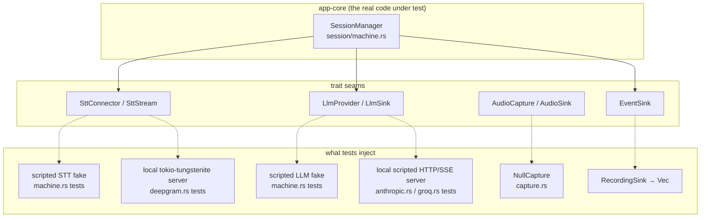

# Development

The working guide: getting a build, how the tests are wired, and how to make
the changes this codebase is actually going to see (a new provider, a prompt
edit) without breaking the invariants that were each purchased with a real
bug. The product contract is [SPEC.md](SPEC.md); per-test rationale is
[TESTING.md](TESTING.md).

---

## Prerequisites and first build

Windows 10/11 only (WASAPI loopback, DPAPI, WebView2 are all load-bearing).

1. **Rust** (stable) via [rustup](https://rustup.rs). MSRV is 1.77
   (`src-tauri/Cargo.toml:10`).
2. **Visual Studio Build Tools** with the **Desktop development with C++**
   workload — this supplies both the MSVC linker and the Windows SDK.
3. **Node.js 20+**.
4. **WebView2 runtime** — already present on current Windows 11.

```sh
npm install
npm run tauri dev      # dev build against the Vite server on :5173
npm run tauri build    # NSIS installer under src-tauri/target/release/bundle/
```

### Build gotchas from this machine's history

- **`LNK1181: cannot open input file 'dbghelp.lib'`** — the Windows SDK is
  missing or, more likely, *still installing*. The Build Tools installer
  returns before the SDK payload is fully unpacked; a build started in that
  window fails at link time on whichever SDK import lib it reaches first.
  Wait for the installer to finish, then rebuild. If it persists, open the
  Build Tools installer and confirm a "Windows 11 SDK" component is actually
  checked.
- **`tauri build` recompiles after a green `cargo build --release`** — not a
  broken cache. `tauri build` compiles the shell with the `custom-protocol`
  feature (`src-tauri/Cargo.toml:40-42`), which plain `cargo build --release`
  does not enable, so the feature-resolved dependency graph differs and the
  crates rebuild. Warming the cache for an installer build means running
  `tauri build` itself once, not `cargo build`.
- The release profile uses `lto = true, codegen-units = 1`
  (`src-tauri/Cargo.toml:44-52`) — release links are slow on this machine by
  design; that is the size/speed trade, not a hang.
- Note the profile deliberately keeps unwind semantics (no
  `panic = "abort"`): §11 requires a panic in one answer pipeline to cost one
  answer, not the process, and the shutdown-path `catch_unwind` in
  `src-tauri/src/window.rs:173-183` would be inert under abort.

### The four checks that define green

```sh
cargo test -p app-core --manifest-path src-tauri/Cargo.toml   # 233 core tests
cargo test --manifest-path src-tauri/Cargo.toml               # + 34 shell tests
npm test                                                      # 290 frontend cases
npm run typecheck                                             # tsc --noEmit, strict
cargo clippy --manifest-path src-tauri/core/Cargo.toml -- -D warnings
```

---

## Test philosophy: every seam is faked, on purpose

**No test touches the network, an audio device, or a live provider** (§12).
This is enforced by construction, not by convention — each external
dependency sits behind a trait, and each trait has exactly one fake or
scripted stand-in:



- **The state machine** (`core/src/session/machine.rs`) is driven entirely by
  scripted fakes under a paused tokio clock — every §5 invariant, including
  the races, is a deterministic test (41 of them; TESTING.md § machine.rs).
- **The wire clients** are tested against scripted local servers on
  `127.0.0.1` so the tests control the exact bytes, including malformed ones:
  tokio-tungstenite for Deepgram (`deepgram.rs` tests), raw HTTP/SSE for the
  providers. Each client has a base-URL escape hatch for exactly this:
  `DeepgramConnector::with_url` (`core/src/stt/deepgram.rs:63-67`),
  `AnthropicProvider::with_base_url` (`core/src/llm/anthropic.rs:66-69`),
  `GroqProvider::with_base_url` (`core/src/llm/groq.rs:47-51`).
- **Audio** never opens a device: `NullCapture`
  (`core/src/audio/capture.rs:344-351`) satisfies the trait on CI/headless
  machines, and everything with logic (framing, resampling, downmix, the
  device-watch decision) is a pure function tested directly.
- **The frontend** talks to one `Bridge` object; tests install a fake via
  `setBridge()` and emit core events exactly as the Rust side would
  (TESTING.md:7). The real components render into a real DOM.

When you add code, the question is never "how do I mock this" — it is "which
existing seam does this belong behind". If the answer is none, you are
probably adding a dependency the architecture says the core must not have.

---

## Adding a fourth LLM provider, end to end

The complete list of touchpoints, in dependency order. Groq
(`core/src/llm/groq.rs`) is the better template — it has no cache-block
special case.

### 1. The provider module — `core/src/llm/yourprovider.rs`

Implement `LlmProvider` (`core/src/llm/mod.rs:91-111`). The trait contract
carries three non-negotiables:

- **Deltas reach the sink the moment they are decoded** — never batched;
  first-word latency is the product.
- **The returned string equals the concatenation of every delta pushed, byte
  for byte** (`mod.rs:95-98`). The UI renders the deltas live and then the
  returned answer; any divergence shows up as text changing after the user
  read it.
- **Abort is checked before any failure is mapped** — a user who pressed Stop
  sees silence, not a scary network error their own cancel caused. Every
  await in the existing providers is a `biased` select against the cancel
  token (`groq.rs:91-100,104-111,122-127`); copy that shape.

Also from the template:

- Missing key → `NoLlmKey` **before any dial**
  (`groq.rs:204-212`).
- Pin the model in exactly one `pub const` (`groq.rs:24-27`).
- Provide `with_base_url` so tests can point at a local server
  (`groq.rs:47-51`).
- Use the shared `SseDecoder` (`core/src/llm/sse.rs`) — it already survives
  hostile chunking (splits at any byte, CRLF/LF/CR, `[DONE]` mid-chunk,
  unterminated final line, split multibyte UTF-8). Do not hand-roll SSE.
- A 200 with zero SSE events is an error, not an empty answer
  (`groq.rs:150-158`).

### 2. The retry predicate contract

Route through `retry::with_retry_once` (`core/src/llm/retry.rs:76-128`). The
helper owns the vetoes (abort, delta-already-emitted); **you** supply only
the "was this a connection-level failure?" predicate. The established
pattern: define your connect-failed and stream-dropped messages as `const`s
and match by **equality**, not substring (`groq.rs:31-35,225-228`) — a
predicate that matches loosely will one day retry an HTTP-status error and
burn the first-token budget.

Rules you inherit for free but must not undermine:

- Build the request body **once**, outside the run closure; the closure
  borrows it (`groq.rs:214-236`). A rebuilt body can differ byte-wise and,
  on cache-capable providers, silently miss the prompt cache
  (`retry.rs:21-25`).
- Never map an abort-caused transport error to anything but
  `AppError::aborted()`.

### 3. The error mapping matrix

Follow the closed set (`core/src/error.rs:13-27`) — the UI keys behavior off
these codes, and a new free-form code silently degrades to "show the raw
message":

| Condition | Code | Message rules |
|---|---|---|
| 401 / 403 | `llm_auth` | Name the **actual** status (a 403 labelled 401 sends the user debugging the wrong thing — `groq.rs:248-255`) and point at Settings. |
| 429 | `llm_rate_limit` | Say what to do (wait / check balance). |
| Model-gone status (404 etc.) | `llm_http` | If the provider retires models, say "update the pinned model constant" like `groq.rs:262-267`. |
| ≥500 / other status | `llm_http` | Status + body `snippet` (≤300 chars, char-boundary safe — `groq.rs:282-296`). |
| Connect failure | `llm_http` | Your `MSG_CONNECT_FAILED` const (retryable). |
| Mid-stream drop | `llm_http` | Your `MSG_STREAM_DROPPED` const (retryable, pre-delta only). |
| 200, no events | `llm_http` | "empty response", never `Ok("")`. |
| Caller abort | `aborted` | Checked first, always. |

### 4. The kind enum and deps assembly

- Add a variant to `LlmProviderKind` and extend `as_str` /
  `parse_or_default` / `label` (`core/src/llm/mod.rs:29-59`). Keep the
  fallback rule: an unknown string in the user-writable settings file parses
  as the default, never an error.
- Wire the match in `build_deps` (`src-tauri/src/commands.rs:306-309`).

### 5. Settings and secrets

- Add the key slot to `Settings`, `SettingsPatch`, and `SettingsView`
  (`core/src/store/mod.rs`), and thread it through:
  `apply_key_patch` in `apply_patch` (`core/src/store/settings.rs:93-95`),
  `key_field` on load (`settings.rs:193-195` pattern), `secrets::protect` on
  save (`settings.rs:244-252`), and `active_llm_key()`.
- The key semantics are three-way and load-bearing: patch field omitted =
  untouched, empty-after-trim = cleared, anything else = replaced trimmed
  (`settings.rs:159-166`). The view exposes only a `has*Key` boolean — key
  material never crosses the IPC boundary.

### 6. Frontend

- `src/types.ts`: the new `hasYourproviderKey` on `SettingsView`, the new
  provider literal.
- `src/views/SettingsView.tsx`: provider `<select>` option, a password key
  field with the `"saved — type to replace"` placeholder semantics, and —
  critically — the save must only include key fields the user actually typed
  into (omission ≠ deletion).

### 7. Tests to write (the definition of done)

Mirror the existing 15-per-provider suite (TESTING.md § groq.rs — that list
*is* the checklist): happy-path delta concatenation, request pinning (model,
stream flag, knobs, auth header, system prompt shape), the full status
matrix, empty-200, mid-stream drop keeps partials, pre-delta drop retried
once with a byte-identical body, cancellation → `aborted`, empty key → no
dial. Plus: the settings key round-trip tests (`settings.rs` test list),
a `SettingsView.test.tsx` case, and one bullet per test in TESTING.md —
what it verifies and why it exists. That documentation rule is §12, not
optional.

---

## Changing the prompt safely

The prompt strings are **product behavior**, pinned verbatim by test
(`core/src/llm/prompt.rs:1-12`; tests listed in TESTING.md § prompt.rs). An
edit is a two-file change by design: the constant in `prompt.rs` *and* the
pinning test. If you find yourself annoyed the test broke — that is the test
working; wording changes are product decisions.

The structural rule is the **cache split** (§3, §7):

- `cached_prefix` = role instructions + resume + JD + grounding note
  (`prompt.rs:83-107`). It must be **byte-stable across calls for identical
  inputs**: no timestamps, no unordered joins, no environment reads. Anthropic
  prompt caching is a byte-prefix match; any nondeterminism silently costs a
  cache write on every call. Pinned by
  `prompt_is_byte_stable_across_repeated_builds`.
- `style_suffix` lives **after** the breakpoint so a style flip never
  invalidates the cached profile. Pinned by
  `style_lives_outside_the_cached_prefix` — all three styles must produce an
  identical `cached_prefix`.
- Per-question content goes in the **user message**, never the system prompt
  (`prompt.rs:118-123`) — that is what keeps the prefix identical across
  questions.

So when adding content, place it by volatility: stable-per-profile → the
prefix; per-toggle → the suffix; per-question → the user wrapper. And
remember the retry path resends the *same* body allocation
(`retry.rs:331-364` proves it) — anything you compute at request time must be
deterministic.

Profile text itself is trimmed only at the edges — interior resume formatting
survives verbatim (`prompt.rs:90-96`), and the grounding note appears only
when a profile section exists (`prompt.rs:103-107`).

---

## The invariants you must not break

Each row is a rule that was purchased with a real bug; the right column is
the test file that will catch you. If a change makes one of these suites
fail, the suite is right until proven otherwise.

| Invariant | Pinned by |
|---|---|
| All 11 session rules of §5: supersession, latest-start-wins, stop taken/not-taken, audio routing, one-error-per-stream, no-event-after-abort, empty-transcript → `no_speech`, timeout interplay, silent cancel, exactly-once slot release | `core/src/session/machine.rs` (41 paused-clock tests) |
| Error codes serialize to the exact wire strings the UI switches on | `core/src/error.rs` |
| Envelope shape `{ok,value}` / `{ok,error}`, event names + camelCase payloads | `src-tauri/src/commands.rs`, `src-tauri/src/events.rs`, `core/src/session/mod.rs` |
| Metrics honesty: `sttFinalizeMs == 0` for typed, `firstTokenMs` never 0 | `core/src/session/mod.rs` |
| SSE decoding is split-point invariant (every byte boundary, CRLF/CR/LF, `[DONE]` mid-chunk, unterminated tail flushed) | `core/src/llm/sse.rs` |
| Provider request pinning + full error matrices + retry policy (one retry, connection-level, pre-delta, byte-identical body) | `core/src/llm/anthropic.rs`, `core/src/llm/groq.rs`, `core/src/llm/retry.rs` |
| Prompt strings verbatim, cache-split, byte stability | `core/src/llm/prompt.rs` |
| Deepgram URL params **and deliberate omissions** (`endpointing`, `no_delay`), CloseStream drain (queued audio flushed first), finalize idempotence, keepalive discipline | `core/src/stt/deepgram.rs` |
| Deepgram frame parsing never panics; `is_final` literally `true`; accumulator commit semantics | `core/src/stt/frame.rs` |
| Settings: per-field fallback, atomic temp+rename writes, three-way key patch semantics, keys never plaintext on disk, view never exposes key material | `core/src/store/settings.rs`, `core/src/store/secrets.rs` |
| Geometry: 40 px rule at clamped size, both axes one display, corrupt-drops-as-unit, negative coords valid | `core/src/store/bounds.rs`, `src-tauri/src/window.rs` |
| Markdown: streaming prefix rendering ≡ one-shot rendering, XSS suite (text nodes only, no attrs from model text, links unparsed) | `src/markdown/streaming.test.tsx`, `src/markdown/xss.test.tsx`, `src/markdown/Markdown.test.tsx` |
| Frontend staleness: wrong-session-id events change nothing; pre-adoption events dropped; history retire/discard rules | `src/state/reducer.test.ts`, `src/state/useSession.test.ts`, `src/views/MainView.test.tsx` |
| Pre-warm through one shared client (pointer identity), throttle window | `core/src/llm/http.rs`, `core/src/llm/warm.rs` |

---

## Paused-clock tokio testing, and its Windows pitfalls

The machine tests all run `#[tokio::test(start_paused = true)]` with two
helpers (`core/src/session/machine.rs:787-802`):

- `settle()` — 32 `yield_now`s: lets already-spawned tasks run **without**
  moving the clock.
- `advance(d)` — implemented as `tokio::time::sleep(d)` then `settle()`, and
  deliberately **not** `tokio::time::advance(d)`: with the clock paused, a
  sleeping test auto-advances to each nearest timer *in order*, running the
  tasks it wakes at the correct virtual instant. A raw `advance` leaps the
  full duration first and stamps every intermediate event with the final
  time — which corrupts exactly the timestamp-sensitive metric assertions.

That model is clean while everything is a fake. The Deepgram tests are the
exception: they run **real loopback TCP sockets** (through Windows IOCP)
under the same runtime, and the paused clock auto-advances whenever the
runtime is *idle* — and "idle" includes "waiting on the OS for socket
readiness". Two rules were learned the hard way (both documented in the
`no_keepalive_is_sent_once_close_is_requested` test,
`core/src/stt/deepgram.rs:795-857`):

1. **Prove establishment before you stop.** Pause the clock only *after* the
   handshake (`deepgram.rs:780-784`), and before testing any stop-time
   behavior, send a transcript through and await it
   (`deepgram.rs:801-808`). A finalize that lands while `connect_async` is
   still resolving legitimately returns immediately with nothing (§6.1 — a
   stream that never opened must not burn the cap), which is *a different
   behavior than the one under test*; on a loaded machine that race made the
   test fail intermittently.
2. **End drains via the server's own Close, never the drain timeout.** The
   earlier version of the test let the 5 s drain cap expire, which relies on
   the cap racing real socket readiness under a paused clock — a race
   auto-advance can win on Windows, killing the connection before the server
   task ever reads the CloseStream (`deepgram.rs:812-821`). Scripting the
   server to answer CloseStream with `Message::Close` makes the ending
   deterministic.

Two smaller patterns worth stealing:

- **Provably-queued frames:** on the default current-thread test runtime,
  issuing several `send_audio` calls with no `await` between them keeps the
  driver task parked, so every frame is still in the channel when finalize
  flips the flag — that determinism is what makes the drain-flush test
  meaningful (`deepgram.rs:1094-1099`).
- **Wall-clock ticks in the frontend:** the recording timer accumulates
  `performance.now()` deltas instead of counting fires, because WebView2
  throttles timers in background windows and the global-hotkey flow runs
  minimized (`src/state/useSession.ts:178-197`). Any new frontend timer gets
  the same treatment.
