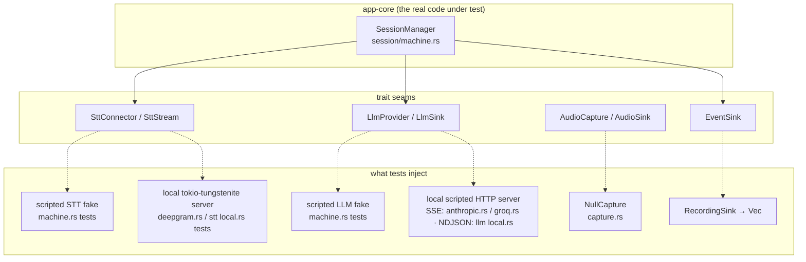

# Development

The working guide: getting a build, how the tests are wired, and how to make
the changes this codebase is actually going to see (a new provider, a prompt
edit) without breaking the invariants that were each purchased with a real
bug. The product contract is [SPEC.md](SPEC.md); per-test rationale is
[TESTING.md](TESTING.md).

---

## Prerequisites and first build

Windows 10/11 only (WASAPI loopback, DPAPI, WebView2 are all load-bearing).

1. **Rust** (stable) via [rustup](https://rustup.rs). MSRV is 1.77
   (`src-tauri/Cargo.toml:10`).
2. **Visual Studio Build Tools** with the **Desktop development with C++**
   workload — this supplies both the MSVC linker and the Windows SDK.
3. **Node.js 20+**.
4. **WebView2 runtime** — already present on current Windows 11.
5. **64-bit Python 3.11+** — only for the optional Free local voice mode
   (`scripts/setup-free-voice.ps1` installs Ollama and the Moonshine speech
   service into an isolated environment; see
   [FREE_VOICE_MODE.md](FREE_VOICE_MODE.md)). Nothing in the Rust or npm
   builds needs it.

```sh
npm install
npm run tauri dev      # dev build against the Vite server on :5173
npm run tauri build    # NSIS installer under src-tauri/target/release/bundle/
```

### Build gotchas from this machine's history

- **`LNK1181: cannot open input file 'dbghelp.lib'`** — the Windows SDK is
  missing or, more likely, *still installing*. The Build Tools installer
  returns before the SDK payload is fully unpacked; a build started in that
  window fails at link time on whichever SDK import lib it reaches first.
  Wait for the installer to finish, then rebuild. If it persists, open the
  Build Tools installer and confirm a "Windows 11 SDK" component is actually
  checked.
- **`tauri build` recompiles after a green `cargo build --release`** — not a
  broken cache. `tauri build` compiles the shell with the `custom-protocol`
  feature (`src-tauri/Cargo.toml:40-42`), which plain `cargo build --release`
  does not enable, so the feature-resolved dependency graph differs and the
  crates rebuild. Warming the cache for an installer build means running
  `tauri build` itself once, not `cargo build`.
- The release profile uses `lto = true, codegen-units = 1`
  (`src-tauri/Cargo.toml:44-52`) — release links are slow on this machine by
  design; that is the size/speed trade, not a hang.
- Note the profile deliberately keeps unwind semantics (no
  `panic = "abort"`): §11 requires a panic in one answer pipeline to cost one
  answer, not the process, and the shutdown-path `catch_unwind` in
  `src-tauri/src/window.rs:173-183` would be inert under abort.

### The checks that define green

```sh
npm run typecheck                             # tsc --noEmit, strict
npx vitest run                                # frontend cases (count in TESTING.md); ~6 min on this machine
npm run build                                 # index + SettingsView(+css) + PracticeLibrary(+css) chunks
python -m pytest -q local-voice/test_server.py   # local speech service unit tests (pip install pytest once)
cd src-tauri
cargo test -p app-core                        # core tests (count in TESTING.md)
cargo clippy -p app-core -- -D warnings       # core lint, clean
cargo test -p aicallhelper                    # shell unit tests
```

`cargo check -p aicallhelper --tests` remains a useful quick check while
iterating, but it is not a gate: the shell tests have to run.

Test counts live in [TESTING.md](TESTING.md) and only there — every other
document says "(count in TESTING.md)" so a new test moves one number, not
four. Cargo serializes on the target-dir lock: never run two cargo commands
at once, and if one blocks on the other, wait. `cargo test -p aicallhelper`,
a full `cargo build --release` and `npm run tauri build` need more disk than
this machine usually has free; when they cannot run here, CI or a second
Windows machine runs them, and a skipped gate is recorded as not passed.

### CI and releases

[`.github/workflows/ci.yml`](../.github/workflows/ci.yml) runs exactly the
gates above on `windows-latest` for every push and pull request (Node 22,
Python 3.13, stable Rust with clippy, `npm ci`). A second job, `package`,
runs only when started by hand (*Actions → ci → Run workflow*): it builds the
NSIS installer with `npm run tauri build` and uploads it as an artifact. That
artifact is not release evidence by itself.

A release follows [RELEASE_CHECKLIST.md](RELEASE_CHECKLIST.md): the gates
(a green CI run on the release commit counts), the packaged build with its
SHA-256 recorded, and the manual checks on the installed app, all recorded
as one row in the checklist's results ledger. Keep "implemented" (code and
tests exist) apart from "validated on hardware" (a ledger row says so).

---

## Test philosophy: every seam is faked, on purpose

**No test touches the network, an audio device, or a live provider** (§12).
This is enforced by construction, not by convention — each external
dependency sits behind a trait, and each trait has exactly one fake or
scripted stand-in:



- **The state machine** (`core/src/session/machine.rs`) is driven entirely by
  scripted fakes under a paused tokio clock — every §5 invariant, including
  the races, is a deterministic test (TESTING.md § machine.rs). The fake LLM
  also overrides `answer_limits()`, which is how the local 90 s / 300 s
  deadlines are pinned without a local model.
- **The wire clients** are tested against scripted local servers on
  `127.0.0.1` so the tests control the exact bytes, including malformed ones:
  tokio-tungstenite for Deepgram and for the Moonshine service, raw HTTP for
  the providers (SSE for Anthropic/Groq, NDJSON for Ollama). Each client has
  a base-URL escape hatch for exactly this: `DeepgramConnector::with_url`,
  `AnthropicProvider::with_base_url`, `GroqProvider::with_base_url`, and the
  `connect_to(url, ..)` seam in `core/src/stt/local.rs`.
- **Audio** never opens a device: `NullCapture`
  (`core/src/audio/capture.rs`) satisfies the trait on CI/headless
  machines, and everything with logic (framing, resampling, downmix, the
  device-watch decision) is a pure function tested directly.
- **Geometry** never needs a monitor: the sanitizer and the dock math are
  pure functions over `WorkArea` values (`core/src/store/bounds.rs`); the
  shell's `restore_geometry`/`dock_to_camera` are thin adapters with no test
  of their own (they need a live window).
- **The shell's local-voice module** is split the same way (R11): the JSON
  parsers, the config parser and the launch plan are pure and unit-tested
  (`src-tauri/src/local_voice.rs` tests); the probe/spawn/wait wrappers are
  thin and untested by design.
- **The frontend** talks to one `Bridge` object; tests install a fake via
  `setBridge()` and emit core events exactly as the Rust side would
  (TESTING.md). The real components render into a real DOM. `LocalVoicePanel`
  is driven through the same `FakeBridge` (`localVoiceStatus`,
  `prepareLocalVoice`), never through `vi.spyOn`.

**StrictMode doubles startup work in dev only** (FE-9). `src/main.tsx` wraps
`App` in `<StrictMode>`, so under `npm run tauri dev` every effect mounts
twice: `get_settings` and `hotkey_status` are issued twice (the `alive` flag
discards the first results) and the six `bridge.on(...)` listeners are
registered, torn down and re-registered — which is precisely the
disposed-before-resolve race the bridge's `on` helper guards, exercised on
every dev launch. Production builds strip the double invocation entirely.
Do not "fix" the doubled IPC by removing StrictMode; profile startup on a
release build (`npm run build` + `tauri build`, or `tauri dev --release`)
and read the `[startup]` stage timings the shell prints to stderr in debug
builds (RS-9, `src-tauri/src/lib.rs:28-34`).

---

## The IPC surface, and which thread each command runs on

Everything the frontend can invoke, from `src-tauri/src/lib.rs` `generate_handler!`
(the TypeScript twins are in `src/types.ts`; every command returns an
`Envelope`):

| Command | Kind | Runs on | Returns | Notes |
|---|---|---|---|---|
| `get_settings` | sync | main thread | `SettingsView` | Short mutex, cache read; never key material. |
| `set_settings(patch)` | **async** | tokio worker → **blocking pool** for lock + `apply_patch` | fresh `SettingsView` | The fsync'd write, DPAPI re-encryption and profile re-serialization run on the blocking pool (RS-3, `commands.rs:79-102`). Side effects run after the lock is released: a changed hotkey is re-registered **on the main thread** via `run_on_main_thread` + a oneshot before `state.hotkey` is written (`commands.rs:142-155`); `set_always_on_top` from the command's thread; a flip to `launchPlacement: camera` docks at once, keeping size. Enum fields are typed: an invalid wire value rejects the invoke (§4). |
| `start_session` | async | tokio worker → blocking pool for the WASAPI open (RS-2) | `SessionId` | Keys proven present first (`required_deepgram_key`/`required_llm_key` keyed off provider capabilities); prewarm; capture installed only while still the slot owner. |
| `stop_session(sessionId)` | async | tokio worker | `null` | NotTaken becomes an error envelope — the one channel that can say "nothing is coming". |
| `ask(text)` | async | tokio worker | `SessionId` | Validates before superseding; no prewarm (RS-1). |
| `cancel_session(sessionId)` | sync | main thread | `null` | Silent. |
| `hotkey_status` | sync | main thread | `HotkeyStatus` | `registered: false` with a non-empty accelerator = another app owns it (or it did not parse). |
| `dock_to_camera` | sync | main thread | `null` | Wide reading preset (`DockSize::Preset`); error `internal` "Could not find the display this window is on." when no monitor resolves. |
| `local_voice_status` | async | tokio worker | `LocalVoiceStatus` | Probes Ollama's `/api/tags` and the speech service's `/health` in parallel, 3 s each. |
| `prepare_local_voice` | async | tokio worker | `LocalVoiceStatus` | Starts what is missing (Ollama first), waits up to 60 s, warms the model; serialized by a `try_lock` so a second click reports "Free mode is already starting." |

`open_external` no longer exists: https navigation was already bounced to
the browser by the window's `on_navigation` hook, so the command was dead
surface (R10). Events are unchanged and listed in `src/types.ts` `EventMap`.

The thread column is the rule, not a description: **nothing that touches the
disk or a device runs on the event-loop thread**, and the one OS call that
genuinely wants the main thread — hotkey registration — hops there
explicitly. ARCHITECTURE.md § 8 has the full threading table.

When you add code, the question is never "how do I mock this" — it is "which
existing seam does this belong behind". If the answer is none, you are
probably adding a dependency the architecture says the core must not have.

---

## Adding another LLM provider, end to end

The complete list of touchpoints, in dependency order. For a keyed cloud
provider, Groq (`core/src/llm/groq.rs`) is the better template — it has no
cache-block special case. For a keyless or loopback provider, the local
provider (`core/src/llm/local.rs`) is the template — see the note after
step 5.

### 1. The provider module — `core/src/llm/yourprovider.rs`

Implement `LlmProvider` (`core/src/llm/mod.rs:119-150`). The trait contract
carries three non-negotiables:

- **Deltas reach the sink the moment they are decoded** — never batched;
  first-word latency is the product.
- **The returned string equals the concatenation of every delta pushed, byte
  for byte** (the `stream_answer` doc in `mod.rs`). The UI renders the deltas live and then the
  returned answer; any divergence shows up as text changing after the user
  read it.
- **Abort is checked before any failure is mapped** — a user who pressed Stop
  sees silence, not a scary network error their own cancel caused. Every
  await in the existing providers is a `biased` select against the cancel
  token (`groq.rs:91-100,104-111,122-127`); copy that shape.

Also from the template:

- Missing key → `NoLlmKey` **before any dial**
  (`groq.rs:204-212`).
- Pin the model in exactly one `pub const` (`groq.rs:24-27`).
- Provide `with_base_url` so tests can point at a local server
  (`groq.rs:47-51`).
- Use the shared `SseDecoder` (`core/src/llm/sse.rs`) — it already survives
  hostile chunking (splits at any byte, CRLF/LF/CR, `[DONE]` mid-chunk,
  unterminated final line, split multibyte UTF-8). Do not hand-roll SSE. (A
  provider that does not speak SSE — Ollama streams NDJSON — gets its own
  small, capped line decoder, as `local.rs` does; the "never batch deltas"
  rule applies just the same.)
- A 200 with zero SSE events is an error, not an empty answer
  (`groq.rs:150-158`).
- Go through `http::shared_client()` for a cloud origin: the pre-warm only
  works because the answer request and the warm share one pool (ADR 005). A
  loopback origin may own its client (`no_proxy`, short connect timeout) and
  make `prewarm()` a no-op — that is the documented scope exception, not a
  loophole.

### 2. The retry predicate contract

Route through `retry::with_retry_once` (`core/src/llm/retry.rs:76-128`). The
helper owns the vetoes (abort, delta-already-emitted); **you** supply only
the "was this a connection-level failure?" predicate. The established
pattern: define your connect-failed and stream-dropped messages as `const`s
and match by **equality**, not substring (`groq.rs:31-35,225-228`) — a
predicate that matches loosely will one day retry an HTTP-status error and
burn the first-token budget.

Rules you inherit for free but must not undermine:

- Build the request body **once**, outside the run closure; the closure
  borrows it (`groq.rs:214-236`). A rebuilt body can differ byte-wise and,
  on cache-capable providers, silently miss the prompt cache
  (`retry.rs:21-25`).
- Never map an abort-caused transport error to anything but
  `AppError::aborted()`.

### 3. The error mapping matrix

Follow the closed set (`core/src/error.rs:13-27`) — the UI keys behavior off
these codes, and a new free-form code silently degrades to "show the raw
message":

| Condition | Code | Message rules |
|---|---|---|
| 401 / 403 | `llm_auth` | Name the **actual** status (a 403 labelled 401 sends the user debugging the wrong thing — `groq.rs:248-255`) and point at Settings. |
| 429 | `llm_rate_limit` | Say what to do (wait / check balance). |
| Model-gone status (404 etc.) | `llm_http` | If the provider retires models, say "update the pinned model constant" like `groq.rs:262-267`. |
| ≥500 / other status | `llm_http` | Status + body `snippet` (≤300 chars, char-boundary safe — `groq.rs:282-296`). |
| Connect failure | `llm_http` | Your `MSG_CONNECT_FAILED` const (retryable). |
| Mid-stream drop | `llm_http` | Your `MSG_STREAM_DROPPED` const (retryable, pre-delta only). |
| 200, no events | `llm_http` | "empty response", never `Ok("")`. |
| Caller abort | `aborted` | Checked first, always. |

### 4. The kind enum and deps assembly

- Add a variant to `LlmProviderKind` and extend `as_str` /
  `parse_or_default` / `label` (`core/src/llm/mod.rs:29-65`). Keep the
  fallback rule: an unknown string in the user-writable settings **file**
  parses as the default, never an error — while on the **wire** the field is
  a typed enum (`SettingsPatch.llm_provider: Option<LlmProviderKind>`), so an
  unknown value from the UI rejects the invoke (§4). Serde handles the wire;
  `parse_or_default` is for the file only.
- Answer the two capability questions honestly (`mod.rs:66-90`):
  `needs_cloud_keys()` (does `start_session` need an LLM key for this kind?)
  and `uses_deepgram()` (does speech go to Deepgram, or to the loopback
  speech service?). Every key check and the STT connector choice key off
  these, never off `== Local` (R5) — that is what lets a new keyless kind
  work without touching `commands.rs`'s guards.
- If the provider's pacing differs from the cloud pair, override
  `answer_limits()` (default `AnswerLimits::CLOUD`; local returns
  `AnswerLimits::LOCAL` = 90 s / 300 s). Add the constants to
  `session::limits`, not the provider — deadlines are core-authoritative
  (ADR 012).
- Wire the match in `build_deps` (`src-tauri/src/commands.rs:362-388`).

### 5. Settings and secrets

- Add the key slot to `Settings`, `SettingsPatch`, and `SettingsView`
  (`core/src/store/mod.rs`), and thread it through:
  `apply_key_patch` in `apply_patch` (`core/src/store/settings.rs:122-124`),
  `key_field` on load (`settings.rs:400` pattern), `secrets::protect` on
  save (`settings.rs:436-444`), and `active_llm_key()`.
- The key semantics are three-way and load-bearing: patch field omitted =
  untouched, empty-after-trim = cleared, anything else = replaced trimmed
  (`settings.rs:280-288`). The view exposes only a `has*Key` boolean — key
  material never crosses the IPC boundary.

**Keyless / loopback providers** (DOC-12). A provider with no key skips this
step entirely: `needs_cloud_keys()` returns false and `required_llm_key`
short-circuits to an empty string (`commands.rs:403-409`); if it also brings
its own speech path, `uses_deepgram()` returns false and
`required_deepgram_key` does the same (`commands.rs:394-401`), so a user can
select it with no keys stored at all (§6.5). Decide what its speech
connector is (`build_deps` pairs a non-Deepgram provider with
`LocalConnector`); decide whether it needs a readiness/launch story like
`src-tauri/src/local_voice.rs` (pure parsers + thin I/O wrappers, R11), and
whether its input needs a size cap the UI should pre-warn about (the local
7 KB rule and its Settings byte counter). The settings file gains nothing
for such a provider except the new `llmProvider` value.

### 6. Frontend

- `src/types.ts`: the new provider literal, the new `hasYourproviderKey` on
  `SettingsView` (keyed providers only), and — the part that drives the UI —
  a row in the `PROVIDERS` catalogue (`label`, `keyFlag`, `usesDeepgram`)
  plus its place in `PROVIDER_ORDER`. The provider `<select>`, the
  first-run rule (`hasRequiredKeys`), the hidden key fields and the
  local-mode banner all derive from that one table instead of scattered
  `=== 'local'` checks.
- `src/views/SettingsView.tsx`: key fields render from the `KEY_FIELDS`
  table and are hidden via the `hidden` attribute when the provider does not
  need them; a password key field keeps the `"saved — type to replace"`
  placeholder semantics, and — critically — the save must only include key
  fields the user actually typed into (omission ≠ deletion). A keyless
  provider that needs a readiness panel gets a component like
  `LocalVoicePanel`, talking to the core through `getBridge()` only.

### 7. Tests to write (the definition of done)

Mirror the existing per-provider suite (TESTING.md § groq.rs — that list
*is* the checklist): happy-path delta concatenation, request pinning (model,
stream flag, knobs, auth header, system prompt shape), the full status
matrix, empty-200, mid-stream drop keeps partials, pre-delta drop retried
once with a byte-identical body, cancellation → `aborted`, empty key → no
dial (or, for a keyless kind, the `needs_cloud_keys`/`uses_deepgram` pins
and a "starts with no keys stored" case like `local_answers_need_no_cloud_keys`).
Plus: the settings key round-trip tests (`settings.rs` test list), a
`SettingsView.test.tsx` case, and one bullet per test in TESTING.md — what
it verifies and why it exists. That documentation rule is §12, not
optional.

---

## Changing the prompt safely

The prompt strings are **product behavior**, pinned verbatim by test
(`core/src/llm/prompt.rs:86-120`; tests listed in TESTING.md § prompt.rs).
An edit is a two-file change by design: the constant in `prompt.rs` *and*
the pinning test. If you find yourself annoyed the test broke — that is the
test working; wording changes are product decisions. That now covers the
four call-type lines, the two non-interview headers and their grounding
note, and the focus / extra-instructions headers
(`call_type_lines_and_new_headers_are_verbatim`) — new sentences are
**added beside** the pinned ones, never edited into them.

The structural rule is the **cache split** (§3, §7, ADR 007):

- `cached_prefix` = role instructions + the whole active profile, in a fixed
  order (`prompt.rs:175-228`): call-type line (nothing for an interview) ·
  resume · JD · grounding note (iff resume or JD is present — focus alone
  does not trigger it) · focus · extra instructions. The header set per call
  type is a straight-line `match` in `sections_for` (`prompt.rs:165-173`) —
  no map lookup, no clock. It must be **byte-stable across calls for
  identical inputs**: no timestamps, no unordered joins, no environment
  reads. Anthropic prompt caching is a byte-prefix match; any nondeterminism
  silently costs a cache write on every call. Pinned by
  `prompt_is_byte_stable_across_repeated_builds` (with a full Sales profile)
  and by `sections_appear_in_call_resume_jd_grounding_focus_extra_order`.
- **An interview profile with empty focus/extra must build the v3 prefix
  byte for byte** — pinned by `migrated_v3_profile_yields_a_byte_identical_prefix`.
  That test is the upgrade promise: existing users' prompts did not change
  and they paid no cache write. Anything that appends to the interview path
  unconditionally breaks it, on purpose.
- `style_suffix` lives **after** the breakpoint so a style flip never
  invalidates the cached profile. Pinned by
  `style_lives_outside_the_cached_prefix` — all three styles must produce an
  identical `cached_prefix`.
- Per-question content goes in the **user message**, never the system prompt
  (`prompt.rs:234-242`) — that is what keeps the prefix identical across
  questions.

So when adding content, place it by volatility: **stable-per-profile → the
prefix** (a profile switch is a deliberate, between-calls cache write, and
the prefix is byte-stable *per active profile*); per-toggle → the suffix;
per-question → the user wrapper. Never put per-question text in the prefix
(a cache write on every question) and never put free text in the prefix
that is not the user's own grounding data — the anti-goal is "no personas"
(ADR 014). Remember the retry path resends the *same* body allocation
(`retry.rs` proves it) — anything you compute at request time must be
deterministic — and that the store side has the same obligation:
`normalize_profiles` is the only writer of the profile list and is pure and
deterministic for exactly this reason (`core/src/store/settings.rs:186-253`).

Profile text itself is trimmed only at the edges — interior resume formatting
survives verbatim (`prompt.rs:177-182`), and the grounding note appears only
when a resume or JD section exists (`prompt.rs:205-211`). The local provider
counts every byte of the joined prompt toward its 7 KB cap, so a new prefix
section also changes what fits in free local mode (§6.5).

---

## The invariants you must not break

Each row is a rule that was purchased with a real bug; the right column is
the test file that will catch you. If a change makes one of these suites
fail, the suite is right until proven otherwise.

| Invariant | Pinned by |
|---|---|
| All 11 session rules of §5: supersession, latest-start-wins, stop taken/not-taken, audio routing, one-error-per-stream, no-event-after-abort, empty-transcript → `no_speech`, timeout interplay, silent cancel, exactly-once slot release; prewarm on Record/Stop/auto-stop and **not** on Ask; deadlines from `answer_limits()` | `core/src/session/machine.rs` (paused-clock tests; count in TESTING.md) |
| Error codes serialize to the exact wire strings the UI switches on | `core/src/error.rs` |
| Envelope shape `{ok,value}` / `{ok,error}`, event names + camelCase payloads; the prompt is built from the ACTIVE profile only; local mode starts with no keys stored | `src-tauri/src/commands.rs`, `src-tauri/src/events.rs`, `core/src/session/mod.rs` |
| Metrics honesty: `sttFinalizeMs == 0` for typed, `firstTokenMs` never 0; `AnswerLimits::CLOUD`/`LOCAL` mirror `limits::*` | `core/src/session/mod.rs` |
| Provider capabilities: `needs_cloud_keys`/`uses_deepgram` false for local; default `answer_limits` is cloud pacing | `core/src/llm/mod.rs` |
| Local provider: request shape (`think: false`, model, context), the 7 KB cap with the exact oversize message, thinking frames never emitted, `AnswerLimits::LOCAL`; Moonshine stream contract | `core/src/llm/local.rs`, `core/src/stt/local.rs` |
| SSE decoding is split-point invariant (every byte boundary, CRLF/CR/LF, `[DONE]` mid-chunk, unterminated tail flushed) | `core/src/llm/sse.rs` |
| Provider request pinning + full error matrices + retry policy (one retry, connection-level, pre-delta, byte-identical body) | `core/src/llm/anthropic.rs`, `core/src/llm/groq.rs`, `core/src/llm/retry.rs` |
| Prompt strings verbatim (incl. the call-type lines and new headers), cache-split, byte stability, the fixed section order, interview prefix byte-identical to v3, unknown call type → interview | `core/src/llm/prompt.rs` |
| Deepgram URL params **and deliberate omissions** (`endpointing`, `no_delay`), CloseStream drain (queued audio flushed first), finalize idempotence, keepalive discipline | `core/src/stt/deepgram.rs` |
| Deepgram frame parsing never panics; `is_final` literally `true`; accumulator commit semantics | `core/src/stt/frame.rs` |
| Settings: per-field fallback (inside a profile too), atomic temp+rename writes, three-way key patch semantics, keys never plaintext on disk, view never exposes key material; profiles: v3 migration read-once and never written back, ≤8, never empty, deterministic id repair, caps by characters, unknown active → first on load / unchanged on patch, a switch patch changes only the active id; `launchPlacement`/`streamFollow` fall back to camera/tail on disk and are typed enums on the wire | `core/src/store/settings.rs`, `core/src/store/mod.rs`, `core/src/store/secrets.rs`, `core/tests/local_settings.rs` |
| Geometry: 40 px rule at clamped size, both axes one display, corrupt-drops-as-unit, negative coords valid, `from_saved` false for the fallback; dock math: top-centre with an 8 px margin, odd-pixel flooring, left-of-primary and top-taskbar displays, wider-than-display hugs the left edge, DPI-scaled preset clamped to the display | `core/src/store/bounds.rs`, `src-tauri/src/window.rs` |
| Markdown: streaming prefix rendering ≡ one-shot rendering, XSS suite (text nodes only, no attrs from model text, links unparsed) | `src/markdown/streaming.test.tsx`, `src/markdown/xss.test.tsx`, `src/markdown/Markdown.test.tsx` |
| Frontend staleness: wrong-session-id events change nothing; pre-adoption events dropped; history retire/discard rules; delta coalescing (first delta paints immediately, later ones merge within 16 ms, terminal events and the supersede paths flush first, never merged across sessions); hotkey ignored while Settings is open | `src/state/reducer.test.ts`, `src/state/useSession.test.ts`, `src/views/MainView.test.tsx`, `src/views/App.test.tsx` |
| UI contract: main-view DOM order, focus mode hides via `hidden` with live regions kept mounted, transcript auto-collapse, profile chips mirror the persisted id and a switch sends ONLY `activeProfileId`, Settings whole-array save + re-seed, dirty guard, hidden key fields per provider, stream-follow `top` seeds the scroll ref | `src/views/MainView.test.tsx`, `src/views/App.test.tsx`, `src/views/SettingsView.test.tsx`, `src/components/AnswerPanel.test.tsx`, `src/views/LocalMode.test.tsx` |
| Pre-warm through one shared client (pointer identity), throttle window, 3 s connect timeout present and no whole-request timeout, keepalive shorter than the pool idle timeout | `core/src/llm/http.rs`, `core/src/llm/warm.rs` |
| Shell local-voice seams: tag/health parsing, config BOM strip + relative-path refusal, launch plan (Ollama first, only what is missing), the speech port pinned against the core's URL | `src-tauri/src/local_voice.rs` |

---

## Paused-clock tokio testing, and its Windows pitfalls

The machine tests all run `#[tokio::test(start_paused = true)]` with two
helpers at the top of the `machine.rs` test module:

- `settle()` — 32 `yield_now`s: lets already-spawned tasks run **without**
  moving the clock.
- `advance(d)` — implemented as `tokio::time::sleep(d)` then `settle()`, and
  deliberately **not** `tokio::time::advance(d)`: with the clock paused, a
  sleeping test auto-advances to each nearest timer *in order*, running the
  tasks it wakes at the correct virtual instant. A raw `advance` leaps the
  full duration first and stamps every intermediate event with the final
  time — which corrupts exactly the timestamp-sensitive metric assertions.

That model is clean while everything is a fake. The Deepgram tests are the
exception: they run **real loopback TCP sockets** (through Windows IOCP)
under the same runtime, and the paused clock auto-advances whenever the
runtime is *idle* — and "idle" includes "waiting on the OS for socket
readiness". Two rules were learned the hard way (both documented in the
`no_keepalive_is_sent_once_close_is_requested` test,
`core/src/stt/deepgram.rs:795-857`):

1. **Prove establishment before you stop.** Pause the clock only *after* the
   handshake (`deepgram.rs:780-784`), and before testing any stop-time
   behavior, send a transcript through and await it
   (`deepgram.rs:801-808`). A finalize that lands while `connect_async` is
   still resolving legitimately returns immediately with nothing (§6.1 — a
   stream that never opened must not burn the cap), which is *a different
   behavior than the one under test*; on a loaded machine that race made the
   test fail intermittently.
2. **End drains via the server's own Close, never the drain timeout.** The
   earlier version of the test let the 5 s drain cap expire, which relies on
   the cap racing real socket readiness under a paused clock — a race
   auto-advance can win on Windows, killing the connection before the server
   task ever reads the CloseStream (`deepgram.rs:812-821`). Scripting the
   server to answer CloseStream with `Message::Close` makes the ending
   deterministic.

Two smaller patterns worth stealing:

- **Provably-queued frames:** on the default current-thread test runtime,
  issuing several `send_audio` calls with no `await` between them keeps the
  driver task parked, so every frame is still in the channel when finalize
  flips the flag — that determinism is what makes the drain-flush test
  meaningful (`deepgram.rs:1094-1099`).
- **Wall-clock ticks in the frontend:** the recording timer accumulates
  `performance.now()` deltas instead of counting fires, because WebView2
  throttles timers in background windows and the global-hotkey flow runs
  minimized (`src/state/useSession.ts:292-310`). Any new frontend timer gets
  the same treatment — and for the same reason the delta coalescer flushes
  on `setTimeout`, never `requestAnimationFrame`, which WebView2 throttles
  outright when the window is minimized.
- **Lazy chunks are slow to boot under jsdom:** a `findBy*` that waits for
  the PracticeLibrary or Settings chunk can take more than the default 1 s on
  a cold run, so those waits carry `{ timeout: 10_000 }`
  (`src/components/AskForm.test.tsx`). Run a single file with
  `npx vitest run <path>` while iterating; the full `npm test` takes about
  six minutes on this machine and that is normal.
