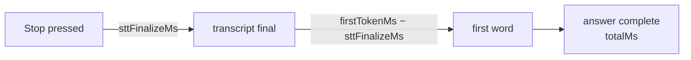

# Troubleshooting

A symptom-first runbook. Errors reach you two ways: as a `session:error` event
rendered in the error box (`role="alert"`), or inside a command's result
envelope (`{ ok: false, error: { code, message } }`,
`src-tauri/src/commands.rs:37-59`). Either way the `code` comes from one
closed set (`src-tauri/core/src/error.rs:13-27`) and the `message` is written
for the person on the call — it says what to do next wherever that is
knowable.

One code you will never see: `aborted`. It means *you* superseded or
cancelled the work, and the UI is required to stay silent about it
(`core/src/error.rs:71-74`; the emission gate that enforces it is
`core/src/session/machine.rs:175-183`).

---

## Error codes

### `no_stt_key`

**You see:** `No Deepgram API key set, so speech can't be transcribed. Open
Settings (gear icon) and add it.` (`core/src/error.rs:97-98`)

**What happened:** Record was pressed with no stored Deepgram key. Checked at
the command gate before anything opens (`src-tauri/src/commands.rs:172`,
`required_deepgram_key` at `commands.rs:394-401`) and again inside the
connector so no socket is ever dialed just to be rejected
(`core/src/stt/deepgram.rs:76-79`). Never raised while **Free local voice**
is selected: that provider's `uses_deepgram()` is false, so speech goes to
the loopback Moonshine service and no Deepgram key is required.

**Fix:** gear icon → paste the Deepgram key → Save. A key of only whitespace
counts as missing (`src-tauri/src/commands.rs:411-413`).

### `no_llm_key`

**You see:** `No {Anthropic|Groq} API key set, so answers can't be generated.
Open Settings (gear icon) and add it.` (`core/src/error.rs:102-104`)

**What happened:** the key for the **selected** provider is missing. If you
switched the provider to Groq, a saved Anthropic key does not count — the
check runs against `active_llm_key()` (`required_llm_key`,
`src-tauri/src/commands.rs:403-409`, and per-provider before any dial:
`core/src/llm/anthropic.rs` (`stream_answer`), `core/src/llm/groq.rs:204-212`).
Never raised while **Free local voice** is selected: `needs_cloud_keys()` is
false for it, so the gate returns an empty key and no cloud provider is ever
built (`commands.rs:362-388`).

**Fix:** add the key for the provider named in the message, or switch the
provider back.

### `stt_connect`

**You see** one of:

- `Connecting to Deepgram timed out after 5 seconds. Check the API key and
  your network.` (`core/src/stt/deepgram.rs:211-221`)
- `Could not connect to Deepgram: {io error}. Check the API key and your
  network.` (`core/src/stt/deepgram.rs:205-209`)
- `Deepgram closed the connection before it was ready: close code 1008
  (DATA-xxxx …). Check the API key and your network.`
  (`core/src/stt/deepgram.rs:465-478`)
- `Could not reach the transcription service. Check your network and try
  again.` — the state machine's own 5 s connect cap
  (`core/src/session/machine.rs:504-514`, `core/src/session/mod.rs:135-136`)

**What happened:** the WebSocket never became usable. The subtle case is the
third one: **Deepgram rejects bad keys by accepting the WebSocket upgrade and
then closing the socket**, usually with no Error frame — close code 1008
carries a `DATA-xxxx` reason (bad key/request), 1011 a `NET-xxxx` server
fault. A successful handshake proves nothing about the key; only a first
frame from the server does, which is why any close before that first frame is
classified as a connect failure, not a mid-call drop
(`core/src/stt/deepgram.rs:253-260`).

**Fix:** a `DATA-xxxx` reason → re-paste the key. No close code at all →
network/firewall. The quoted code and reason are the only diagnostics
Deepgram offers on this path, so read them.

### `stt_error`

**You see** one of:

- `Lost the Deepgram connection: close code N (…)` / `: {io error}.`
  (`core/src/stt/deepgram.rs:465-486`)
- `Deepgram reported an error: {detail}` — a server Error frame mid-call
  (`core/src/stt/deepgram.rs:302-310`)
- `Deepgram reported an error while finalizing: {detail}` or `Lost the
  Deepgram connection while finalizing the transcript. Try again.` — a death
  during the CloseStream flush (`core/src/stt/deepgram.rs:370-381,419-427`)

**What happened:** the STT stream died *while the transcript still mattered*
(mid-recording or mid-finalize). Policy (§5.5): one honest error and the
session is torn down, because a silently truncated transcript answers the
wrong question (`core/src/session/machine.rs:550-556,610-617`). The flip
side: once the transcript is finalized the stream's job is done — a late
socket close cannot kill an answer that is already streaming
(`core/src/session/machine.rs:646-649`). So if you get `stt_error` while an
answer was painting, the death happened *before* finalize completed, not
after.

**Fix:** press Record again; the session is gone. If it repeats, it is your
network to Deepgram, not the app.

### `stt_timeout`

**You see:** `Timed out waiting for the final transcript. Try again.`
(`core/src/session/machine.rs:628-641`)

**What happened:** Stop was pressed, CloseStream went out, and Deepgram did
not finish flushing its tail within the 5 s cap
(`core/src/session/mod.rs:133-134`). Distinct from `stt_error` on purpose —
this is "the flush hung", not "the socket died" — so you debug the right
stage.

### `no_speech`

**You see:** `No speech detected in the recording. Make sure call audio is
playing.` (`core/src/error.rs:99-100`, raised at
`core/src/session/machine.rs:651-657`)

**What happened:** the finalized transcript trimmed to nothing, and the core
refuses to send an empty prompt to the LLM (§5.7). The app records
**loopback** — what comes out of your default *playback* device — not the
microphone (`core/src/audio/capture.rs:1-9`). So the usual causes:

- nothing was actually playing through the speakers (the other person was
  silent, or you recorded your own thinking pause),
- call audio is routed to a device that is **not** the Windows default output
  (headset vs. speakers),
- the call app's output volume is near zero.

A dead level meter during the recording is the early warning for the same
problem — see [Dead level meter](#dead-level-meter-while-recording).

What this is deliberately NOT anymore: a slow Deepgram dial. A stop that
lands while the WebSocket is still connecting now waits the dial out and
flushes the buffered question (`core/src/stt/deepgram.rs`, the dial loop),
and a dial that *fails* under a pending stop surfaces `stt_connect` instead
of an empty transcript. If you see `no_speech` on a slow network today, the
connect succeeded and the recording really carried no speech.

### `llm_auth`

**You see:**

- Anthropic: `Anthropic rejected the API key (401). Check it in Settings.` or
  `Anthropic refused the request (403): this API key is not allowed to use
  the model. Check it in Settings.` (`core/src/llm/anthropic.rs`, `map_status`)
- Groq: `Groq rejected the API key (401|403). Check it in Settings.` — the
  message reports the *actual* status (`core/src/llm/groq.rs:252-255`)

**What happened:** the provider heard the request and refused the
credentials. Never retried — the server said no, and it will say no again
(`core/src/llm/retry.rs:8-13`).

**Fix:** 401 → the key is wrong; re-paste it. 403 → the key is valid but not
entitled to the model (organization limits, expired plan).

### `llm_rate_limit`

**You see:** `Anthropic rate limit hit (429). Wait a moment, or check your
credit balance.` (`core/src/llm/anthropic.rs`, `map_status`) or `Groq rate limit
hit (429). Wait a moment before asking again.` (`core/src/llm/groq.rs:256-259`)

**What happened:** 429 from the provider. On Anthropic this is also what an
exhausted credit balance looks like — hence the message.

### `llm_http`

The catch-all for "the provider or the pipe failed". Variants and their
meanings:

| Message | Raised at | What it means |
|---|---|---|
| `Could not reach Anthropic|Groq. Check your internet connection.` | `anthropic.rs:35` + `stream_once` / `groq.rs:33,94-100` | The dial never completed. This message is in the retry predicate — it was already retried once before you saw it (the `with_retry_once` call in `stream_answer`). |
| `The connection … dropped while the answer was streaming. Try again.` | `anthropic.rs:36-37` + `stream_once` / `groq.rs:34-35,129-136` | Mid-stream drop. Retried only if no delta had reached the UI yet — a retry after painted text would concatenate two answers (`core/src/llm/retry.rs:14-18`). Your partial answer is kept. |
| `Anthropic is overloaded (529). Try again in a moment.` | `anthropic.rs`, `map_status` | Anthropic-side overload. Not your setup. |
| `Groq returned 404 for model "openai/gpt-oss-120b" — the model may have been retired — update the pinned model constant.` | `groq.rs:262-267` | Groq retires models on short notice. The fix is editing `GROQ_MODEL` (`core/src/llm/groq.rs:27`) — the error says so precisely because nobody remembers this under pressure. |
| `Groq is unavailable (HTTP 5xx). Try again in a moment.` | `groq.rs:268-271` | Groq-side outage. |
| `Anthropic|Groq returned HTTP N: {body snippet}` | `anthropic.rs` `map_status` / `groq.rs:272-276` | Anything else; the snippet (≤300 chars, `groq.rs:282-296`) is your only clue. |
| `… returned an empty response …` | `anthropic.rs:187-196` / `groq.rs:150-158` | HTTP 200 with zero SSE events — a broken response, refused rather than rendered as the model silently saying nothing. |
| `Anthropic reported an error mid-stream: {detail}` | `anthropic.rs:230-238` | The SSE stream itself carried an error event. |

### `settings_conflict`

**You see:** in Settings, *"Settings changed elsewhere — reload. Your unsaved
edits are kept."* The Save button is disabled. (The core's message is
`Settings changed while this form was open. Reload it.`,
`core/src/store/settings.rs`.)

**What happened:** the form was opened from an older saved state than the
one now committed. Usually a profile or style chip click was still saving
when Settings opened. Nothing was saved (ADR 016). Press **Reload**: fields
you edited keep your text, fields you did not touch take the saved values,
and then Save works. A window move never causes this, because geometry saves
do not count as a settings change.

### `llm_first_token_timeout`

**You see:** `The model did not start answering in time. Try again.`
(`core/src/session/machine.rs:717-727`)

**What happened:** 10 s elapsed after Stop with no first delta
(`core/src/session/mod.rs:139`) — or **90 s** in Free local voice mode
(`mod.rs:143`): the deadline pair comes from the provider's
`answer_limits()` (`AnswerLimits::CLOUD` / `LOCAL`, `mod.rs:162-175`), armed
at `core/src/session/machine.rs:705-707`. The timer is disarmed by the first
delta; once tokens flow only the total cap applies. Deltas that race in
after the timeout fired paint nothing (`machine.rs:456-466`). In local mode
a first token that takes tens of seconds is CPU inference on a 2B model
ingesting the whole prompt — see [Free local voice mode](#free-local-voice-mode)
before blaming the network.

### `llm_timeout`

**You see:** `The answer took too long and was stopped. Try again.`
(`core/src/session/machine.rs:729-739`)

**What happened:** 60 s total elapsed — **300 s** in Free local voice mode
(`core/src/session/mod.rs:141,144`). Whatever streamed before the cap stays
in the panel — an error during a streaming answer keeps the partial (§9).

### `internal`

Free-form messages for everything without its own code. The ones worth
recognizing:

- `No audio playback device is active, so call audio can't be captured.
  Enable a speaker or headphone output in Windows sound settings and try
  again.` (`core/src/audio/capture.rs:24-25`) — no default output device
  exists, or it died mid-recording.
- `The default playback device changed to "X" while recording, so call audio
  is no longer being captured. Press Record to capture the new device.`
  (`core/src/audio/capture.rs:276-281`) — you plugged in a headset
  mid-recording. WASAPI keeps capturing the *original* device after the
  default moves; the watcher polls every 2 s and surfaces this once
  (`core/src/audio/capture.rs:218,261-286`). Device errors are phase-aware:
  after Stop was pressed they are ignored, so a Bluetooth dropout cannot kill
  an answer already streaming (`core/src/session/machine.rs:353-390`).
- `The audio capture thread failed to start. Try restarting the app.`
  (`src-tauri/src/commands.rs:246-248`) — the WASAPI open, which runs on
  tokio's blocking pool, panicked before it could report a device (RS-2).
  Distinct from the device messages above on purpose: there is no device to
  fix, the process is unhealthy. The machine session was cancelled silently,
  so nothing else is coming for it.
- `Stop not taken: that session is unknown, already stopping, or already
  ended. No further events will arrive for it.`
  (`src-tauri/src/commands.rs:267-271`) — the stop contract's return value
  (§4/§5.3). You should never see this rendered; the UI uses it to leave
  "Finalizing…" (`src/state/useSession.ts`, the stop path).
- `Could not save settings: {io error}` (`core/src/store/settings.rs:129`)
  — the atomic write failed (full disk, locked file). Memory still matches
  disk: nothing was half-saved. `Could not save settings. Try again.`
  (`src-tauri/src/commands.rs:103-105`) is its rarer sibling: the blocking
  task that performs the write panicked; the store's mutex recovers from
  poisoning, so a second Save has every chance.
- `Your settings file was damaged and could not be read. It was kept as
  settings.json.corrupt-<seconds> in the app's data folder, and the app
  started with default settings.` (`core/src/store/settings.rs`,
  `load_from`, ADR 016). This is shown at launch and as a note in Settings.
  The file held no JSON object (a hand edit gone wrong, or disk damage). The
  copy sits in `%APPDATA%\com.aicallhelper.app\`. Recover text from it if
  you need to. Saving works normally, and the first save clears the note.
- `Your settings file could not be read (…)` / `Your settings file is
  damaged and a backup copy could not be made (…)`. The app is running on
  defaults and **refuses every save**, so it never overwrites a file it could
  not read or preserve. Close whatever has `settings.json` open (an editor,
  a sync or backup tool, an antivirus scan). For the damaged case, move the
  file out of the data folder. Then restart the app.
- `Could not find the display this window is on.`
  (`src-tauri/src/window.rs:112`) — the ⬆ **Dock to camera** button could
  resolve neither the window's current monitor nor a primary one. Rare
  (remote desktop mid-reconnect, a display set in flux); the window stays
  where it is. On the launch path the same failure is swallowed and the
  sanitizer's placement stands. `Could not move the window: …` is the OS
  refusing a size or position call on the same path.
- `The main window is not available.` — a window command (`dock_to_camera`)
  ran while the main window was already gone; only reachable during
  shutdown.
- Settings saved from the wrong thread cannot happen any more: `set_settings`
  is async and does its write on the blocking pool (RS-3), so a slow disk
  stalls the Save button, never the paint.
- Free local voice messages (`Free voice is not installed yet…`, `Free mode
  is already starting…`, `Local speech did not start…`, `Qwen3.5 2B is not
  installed in the running Ollama service…`) are listed in
  [Free local voice mode](#free-local-voice-mode).

---

## Silent symptoms

### Dead level meter while recording

The meter's only input is `audio:level`, emitted exactly when a frame is
accepted by the live session (`core/src/session/machine.rs:396-411`). Work
through the causes in order:

1. **Silence is silence.** RMS of a silent call is genuinely 0
   (`core/src/audio/mod.rs`, `rms_of_silence_is_zero`). If nobody is
   speaking, a dead meter is correct.
2. **The default device moved.** The watcher polls the default output
   device's identity every 2 s and raises one error when it changes
   (`core/src/audio/capture.rs:261-286`). If the meter died and *no* error
   appeared within a couple of seconds, the device did not move — keep going.
   (The watcher deliberately stays silent when the default *disappears*
   entirely: the stream's own error callback owns that report, and
   double-reporting reads as a crash loop —
   `core/src/audio/capture.rs:220-226`.)
3. **Audio is on a non-default device.** Loopback captures the default
   *render* device (`core/src/audio/capture.rs:131-141`). If Zoom outputs to
   "Headset" but Windows' default is "Speakers", the app records silence from
   the speakers. Make the device carrying call audio the Windows default.
4. **Surround downmix.** On a 5.1/7.1 default device only FL, FR and FC are
   mixed — the channels where dialog lives; LFE and surrounds are excluded
   because an equal average over six channels divides the voice by 6
   (`core/src/audio/resample.rs:98-120`, pinned by
   `surround_downmix_uses_the_speech_channels_not_all_of_them`,
   `resample.rs:239-265`). Content panned *only* to rear channels mixes to
   zero. If your audio setup does something exotic with channel routing,
   switch the default to a stereo endpoint.
5. **The capture never installed.** A Record press superseded during the
   ~100 ms WASAPI open stops its own capture instead of installing over the
   winner (`src-tauri/src/commands.rs:155-170`). Transient by construction —
   the *winning* press has its own capture.
6. **Frames route only to the live, not-yet-stopped session.** After Stop,
   frames (and their level events) are dropped by design — they would race
   the CloseStream flush (`core/src/session/machine.rs:392-396`). A meter
   that freezes the instant you press Stop is correct behavior.

### Window opens at the top of the screen instead of where you left it

That is the default, not a bug: **Window position at launch** is set to
"Dock under the camera (top centre)" (`launchPlacement: "camera"`, the
default — `core/src/store/mod.rs:110-120`). Every launch keeps the saved
*size* and replaces the *position* with the top-centre of the display the
window is on, 8 px below the work-area edge, before the window is shown
(`src-tauri/src/lib.rs:110-117`, `src-tauri/src/window.rs:106-135`). The
position you dragged to is still saved; it is simply not used at launch.
To get the v3 behaviour back, switch the setting to "Remember where I left
it". The ⬆ **Dock to camera** button does the same move at any time, at the
wide reading preset (600 logical px wide, 45 % of the display height,
clamped to 520–720 logical px). ADR 013 has the reasoning.

**A docked window vanishes behind the call.** You turned "Keep this window
always on top" off. A docked window drops behind the call app the moment
the call is focused; it looks like the dock "did not work". Turn always-on-top
back on.

**First run looks smaller or larger than you expect on a hi-DPI laptop —
or, rather, it no longer does.** The first-run size is the builder's
*logical* 460×700, which tao scales by DPI; the app used to re-apply it as
physical pixels and shrink the window by the scale factor, then persist that
as your "choice" (RS-7). The sanitizer now reports whether bounds came from
the file (`from_saved`) and the shell only calls `set_size` when they did
(`core/src/store/bounds.rs:59-76`, `window.rs:45-47`). If an old
settings file still carries a too-small saved size, drag the window larger
once; the next save fixes it.

### Window opens at the top (or centred) with "Remember where I left it" set

Then the placement is the sanitizer's *deliberate* verdict: the saved
position is honored only when it can be proven visible right now
(`core/src/store/bounds.rs:101-137`), and when it cannot, the window is
docked to the camera at its saved size — centred only if even the dock fails
because no display can be resolved (`src-tauri/src/window.rs:42-58`). The
rules, each of which can eat a position:

- **The 40 px rule:** at least 40 px of the window must land on some
  display's work area on *both* axes — enough to grab the ~32 px title bar
  and drag it back (`core/src/store/bounds.rs:31-34`). 39 px fails.
- **Both axes on the same display:** an L-shaped monitor arrangement cannot
  satisfy one axis per monitor (pinned by test).
- **Judged at the clamped size:** size is clamped up to the 380×520 minimum
  *first*, and visibility is judged at that size (`bounds.rs:122-123`). The
  minimum is the logical floor at 100 % scale on purpose (DOCK-4): on a
  hi-DPI display the OS enforces a larger floor, and judging at the smaller
  size can only reject positions the larger window would also fail.
- **Work area excludes the taskbar:** a position entirely over the taskbar
  strip is not visible (pinned by test).
- **Corrupt values drop the whole geometry**, not one field — NaN, ∞, 1e300
  anywhere means full fallback.
- **Monitor enumeration failed:** an empty display list can prove nothing, so
  the position is dropped (`src-tauri/src/window.rs:72-80`) — and then, with
  no monitor to dock to either, the window centres.
- Negative coordinates are *valid* (a monitor left of primary) — that is not
  one of the failure causes; the dock math handles them too
  (`dock_follows_a_monitor_left_of_primary`).

If the position is being *saved* wrong rather than restored wrong:

- **The minimized-save guard:** a minimized window measures at
  (-32000,-32000); saving that would clobber real geometry, so a minimized
  window contributes nothing and the last debounced value is used instead
  (`src-tauri/src/window.rs`, `current_bounds`).
- **Inner size on purpose:** restore applies through `set_size` = inner size,
  so the save must record inner size too — saving the outer rect would grow
  the window by the decoration size (~16×39 px) on every launch, forever.
  Docking saves the same way: the `Moved`/`Resized` events it raises go
  through the normal debounced save, so a docked position persists exactly
  like a drag.
- Saves are debounced 500 ms and flushed on both close paths
  (`src-tauri/src/window.rs`, `schedule_bounds_save`); a kill mid-drag keeps
  the last debounced value.

### Hotkey chip missing vs. the "taken" notice

Two different states that look similar:

- **Chip missing, no notice:** the accelerator is empty — you disabled the
  shortcut. Empty means disabled and must not spring back to the default
  (`src-tauri/src/hotkey.rs:36-41`, `core/src/store/settings.rs:87-92`).
  A whitespace-only hotkey normalizes to empty on save.
- **Chip missing, notice shown** (`"<hotkey> is already taken by another app,
  so the shortcut is off — record from this window, or pick a different one
  in Settings."`): registration was *attempted and failed*. Registration is
  honest: parse failures and OS rejection (another app owns the combo) both
  land as `registered: false` rather than advertising a dead key
  (`src-tauri/src/hotkey.rs:43-56`). The notice renders only when the
  accelerator is non-empty AND unregistered — accusing another app of
  stealing a nameless key would be a false claim
  (`src/views/MainView.tsx`, the notice right after the Record button).

Also remember the hotkey is **ignored while Settings is open** — you may be
typing the hotkey itself into the hotkey field. The session hook takes a
`hotkeyEnabled` predicate that App answers with "Settings is not open"
(`src/App.tsx:34`, `src/state/useSession.ts:274-277`). If the hotkey "stops
working" with Settings open, that is the feature.

**The shortcut changed but still fires the old combo / reports taken.** A
changed hotkey is re-registered from the main thread — `set_settings` is
async now, and it hops back with `run_on_main_thread` + a oneshot before
recording the result (`src-tauri/src/commands.rs:142-155`), because
RegisterHotKey binds a hot key to the calling thread's window. If the event
loop refuses the hop (it is shutting down), registration is attempted from
the current thread rather than reporting a key nobody tried. Re-open the
main view after saving: the chip and notice re-read `hotkey_status`.

**Ctrl+Shift+F does nothing.** That combo toggles Focus mode *inside* the
window only (it is not a global shortcut, and it is ignored while a text
field has focus). If you set the global hotkey to the same combo, the OS
consumes it before the window ever sees it — use the ◎ header button, or
pick a different global hotkey.

### Answers slower than ~1 s

Start with the latency chip's hover tooltip
(`src/format.ts:68-70`, rendered at `src/components/AnswerPanel.tsx:183-185`):

> `First word N ms after Stop · transcript finalized N ms · full answer X.X s`

Both numbers count from the instant Stop was requested
(`core/src/session/mod.rs:23-34`). Read them as a two-stage budget:

- **`sttFinalizeMs` is large (≫300 ms):** the Deepgram tail flush is the
  bottleneck — network to Deepgram, or a flush limping toward the 5 s cap.
  Nothing LLM-side will help. (`0` means a typed Ask — there was no STT
  stage; `core/src/session/machine.rs:275-277`.)
- **`firstTokenMs − sttFinalizeMs` is large:** the LLM leg is slow. Check in
  order:
  1. **Was the pre-warm defeated?** Warming fires on Record, on Stop and on
     the 120 s auto-stop (`core/src/session/machine.rs:230,265,576`) — not
     on Ask (RS-1: the answer request fires microseconds later, so a warm
     could only race it for the pool) — and is throttled to one warm per
     origin per 2 s (`core/src/llm/warm.rs:34,50-66`), so rapid-fire
     supersession can land a request on a colder connection than usual.
     Also: the warm only works because every cloud request rides the one
     shared `reqwest::Client` (`core/src/llm/http.rs:1-12`) with a 120 s pool
     idle timeout (`http.rs:30`); a recording longer than that can outlive
     the warmed socket from Record time — the Stop-time warm exists to
     re-cover exactly this. Since RS-6 the client also probes idle sockets
     with TCP keepalive from 20 s (a NAT/VPN gateway that forgot the mapping
     used to cost a dead first write plus a cold retry) and gives up on a
     black-holed connect after 3 s instead of the OS's ~21 s
     (`http.rs:38-60`) — a first word that arrives after roughly 3–4 s with
     a healthy provider is the retry policy doing its job on a bad route.
  2. **Provider choice.** Groq's gpt-oss is a reasoning model; the app
     already sends `reasoning_effort: "low"` and `include_reasoning: false`
     (`core/src/llm/groq.rs:61-67`), but first-word behavior still differs
     between providers — flip the provider and compare. Free local voice is
     not in the ~1 s class at all: expect seconds to tens of seconds on a
     laptop CPU, with ceilings of 90 s / 300 s.
  3. **Prompt size.** The whole active profile — resume, job description,
     focus, extra instructions — rides every request. The Anthropic
     cache-split means a style flip never invalidates the cached profile,
     and a *profile switch* costs at most one cache write on the next
     question — but honesty: below Haiku's 4096-token minimum the
     `cache_control` marker is a silent no-op, and it only starts paying at
     roughly 16 K+ characters of profile
     (`core/src/llm/anthropic.rs`, `request_body`).
     `usage.cache_read_input_tokens` is parsed and exposed as the ground
     truth (`anthropic.rs`, `last_cache_read_input_tokens` + the usage parse
     in `apply_event`). If a profile you rarely use is the fat one, keep it
     as a separate profile rather than carrying its text in every call.
- **`firstTokenMs == totalMs`:** the provider returned a complete answer
  without ever streaming a delta; the metric reports total rather than lying
  with 0 (`core/src/session/mod.rs:36-49`).

One thing that is *never* the cause: a retry after an HTTP error status —
those are not retried at all (`core/src/llm/retry.rs:8-13`). A silent retry
happens only for a connection-level failure before any delta, so it can cost
you at most one extra dial (`core/src/llm/anthropic.rs`, the `is_retryable`
closure in `stream_answer`).

### Transcript missing its final words

This was a real bug and is now fixed: frames captured between the socket
pump's last poll and the Stop are flushed to the wire **before** CloseStream
goes out (`core/src/stt/deepgram.rs:334-345`), pinned by
`audio_queued_at_stop_is_flushed_before_close_stream`
(`deepgram.rs:1080-1119`). CloseStream then makes the server flush its
smart_format hold-back (numbers, dates held until it is sure of them —
`deepgram.rs:346-361`).

If it recurs, suspects in order of likelihood:

1. **The drain changed.** Anything that breaks out of the drain before the
   `audio_rx.try_recv()` sweep, or that gates finalize-phase errors on
   `close_requested` instead of `aborted` only, re-opens the exact truncation
   §5.5 exists to prevent (`deepgram.rs:415-445` documents why the gates
   differ).
2. **The finalize select ordering.** The finalize loop is `biased` with the
   STT channel polled before the finalize future, so a queued death always
   beats a truncated transcript resolving in the same instant
   (`core/src/session/machine.rs:594-604`). An "optimization" that removes
   `biased` makes the truncated text win half the time.
3. **Words spoken after Stop.** Frames arriving after Stop was requested are
   dropped *by design* — they would race the CloseStream flush
   (`core/src/session/machine.rs:392-396`). Words said after you pressed the
   button were never going to be in the transcript.
4. **The frame queue.** The capture-to-forwarder channel holds ~4 s of frames
   (`core/src/audio/capture.rs:27-30`); a wedged consumer drops frames rather
   than stalling the audio engine. This loses mid-recording audio, not
   specifically the tail — but it is the only other place frames can vanish.

### The Ask box, the transcript and the chips vanished

Focus mode is on (the ◎ header button is pressed, or you hit Ctrl+Shift+F
inside the window). It hides the profile chips, the Ask row and its hints,
the local-mode banner and the "Question heard" strip via the `hidden`
attribute and grows the answer text to 18 px; the header, the answer, the
error box, the status line and the Record row stay. It is not persisted —
a relaunch starts with everything visible. Press the button (or the combo)
again.

### "Question heard" is a single line

The transcript strip auto-collapses to a one-line caption of the question
once recording ends and stays open only while starting / recording /
finalizing, or when idle with no question yet (so the pinned placeholder is
still visible). Click its heading (a button with `aria-expanded`) to open
it; it collapses again on the next finished question.

### Answers grounded in the wrong job — or in nothing

The prompt is built from the **active** call profile, the one whose chip is
pressed on the main view (`src-tauri/src/commands.rs:358-360`), and it is
built when a session starts, so a switch during a recording applies to the
*next* one. If the chips are missing, you have a single profile. If the
main view says `No resume or job description saved for <name> — answers
won't be grounded. Add them in Settings.`, the active profile is empty on
both fields and the grounding note is deliberately omitted (§7). A switch to
a profile that no longer exists is ignored — the chip that stays lit is the
truth, not the one you clicked.

### The window shows up in a screen share or recording

The app requests Windows capture exclusion. Its effect depends on the
Windows version and capture method. Check the recorded compatibility results
and test your intended sharing setup before relying on it.

**What the app does:** before the window is first shown it calls Tauri's
`set_content_protected(true)` (`src-tauri/src/lib.rs:125`), which asks
Windows for display affinity `WDA_EXCLUDEFROMCAPTURE` through
[`SetWindowDisplayAffinity`](https://learn.microsoft.com/en-us/windows/win32/api/winuser/nf-winuser-setwindowdisplayaffinity).
There is no toggle. That display affinity value is supported only on
Windows 10 version 2004 (build 19041) or later, and Microsoft describes it as
protection against a specific set of public capture APIs, not a guarantee
against every capture method.

**What the app checks:** after the request, the app reads the window's
display affinity back from Windows (`GetWindowDisplayAffinity`) and refuses to
start unless it is `WDA_EXCLUDEFROMCAPTURE`; the reason is written to
`crash.log`. This is needed because tao 0.35 discards the result of the
underlying Windows call. **What it cannot check:** a capture method outside
Microsoft's list, a hardware capture device or a phone camera can still show
the window with no error from the app.

**What to do:**

1. Check `winver`: Windows 10 version 2004 or later, or Windows 11.
2. Test the exact setup you will use before the call: the conferencing
   application and its version, whole-screen versus single-window sharing,
   and any recording tool. Share or record, and look at the result from a
   second device or the recording itself.
3. If the window appears, do not rely on the exclusion for that setup. Report
   the conferencing application and version, the Windows build and the
   capture mode, so the result can be added to the table below.

### Tested sharing configurations

Only configurations with a recorded run appear here; each row also has a
matching entry in the results ledger of
[RELEASE_CHECKLIST.md](RELEASE_CHECKLIST.md#part-b--results-ledger). A result
applies to that application version, Windows build and capture mode only.

| Conferencing app + version | OS build | Capture mode | Result | Date |
|---|---|---|---|---|
| — | — | — | No configuration has been tested and recorded yet. | — |

### Free local voice mode

Setup, limits and logs are in [FREE_VOICE_MODE.md](FREE_VOICE_MODE.md);
this is the runtime error map. Every local message reaches you through the
same envelopes and codes as the cloud ones, with these texts:

| Message | Code | What it means / fix |
|---|---|---|
| `Free voice is not installed yet. Run scripts\setup-free-voice.ps1 from the project folder, then retry. Setup requires Python and several GB of free disk space.` | `internal` (`src-tauri/src/local_voice.rs:123-125`) | `%LOCALAPPDATA%\AI Call Assistant\local-voice.json` is missing, unreadable, names a *relative* folder, or the recorded executables cannot be spawned. Run the setup script; a hand-edited config must carry an absolute `dataDir`. |
| `Free mode is already starting. Please wait.` | `internal` (`local_voice.rs:273-276`) | A second **Start and warm** while the first is still running; the command is serialized by a `try_lock`. Wait for the panel to settle. |
| `Local speech did not start. Check speech.log in your free voice setup folder and rerun setup if the models are missing.` | `internal` (`local_voice.rs:291-293`) | The speech service was launched but did not report ready within 60 s. Its stderr is `speech.log` in the setup folder (unbuffered, so the crash line is there). |
| `Qwen3.5 2B is not installed in the running Ollama service. Run free voice setup to finish the download.` | `internal` (`local_voice.rs:294-296`) | Ollama answers `/api/tags` but the model tag is absent — usually a download that was interrupted, or a pre-existing Ollama instance with a different model folder. Close that instance before setup, or rerun setup. |
| `Could not warm Ollama. Check free voice setup and available memory, then retry.` / `Invalid Ollama warm-up response.` | `llm_http` (`core/src/llm/local.rs:194-215`) | The warm-up request (an empty chat that loads the model for 10 min) failed or returned garbage. Almost always RAM: the runner wants ~3 GB. |
| `Qwen3.5 2B is not installed. Run free voice setup to download it.` | `llm_http` (404, `local.rs:47`) | Same as above, seen at answer time. |
| `Ollama could not load or run the local model. Close unused apps to free several GB of RAM, then start and warm free mode again. Check ollama.log if this continues.` | `llm_http` (500, `local.rs:48`) | Model load failed — `std::bad_alloc` in `ollama.log` is the usual signature. Free memory (and Windows paging space), then warm again. |
| `Ollama returned HTTP N. Check the local service and retry.` | `llm_http` (`local.rs:49`) | Anything else from Ollama. |
| `Free local mode supports about 7 KB of combined instructions, profile (resume, job description, focus, extra instructions) and question. Shorten the active profile in Settings or use a cloud model.` | `llm_http` (`local.rs:19-24,62-63`) | The joined prompt plus the question exceeds 7,000 UTF-8 bytes. Checked *before* dialling, so nothing was sent. The same message appears before recording starts when the active profile leaves no room for any question, and before a typed question is sent when that question does not fit. With local mode selected, Settings shows the exact bytes the profile leaves for a question, computed by the same code that enforces the cap. It warns under 200 bytes and says when no question fits. Every profile field counts. |
| `Ollama is unavailable. Open Settings and start and warm free local mode.` / `The local answer connection ended unexpectedly. Try again.` / `Ollama stopped before finishing the answer. Try again.` / `Ollama returned an invalid streaming response.` / `The local model returned an empty answer. Try again.` | `llm_http` (`local.rs:128-190`) | The service is not running (start and warm it), died mid-answer, closed the stream without a `done` frame, streamed something that is not NDJSON, or produced only whitespace. Not retried: the local provider has no retry predicate, and the connection is loopback. |
| `Ollama could not generate an answer. Check that qwen3.5:2b is installed, then start and warm free mode in Settings.` | `llm_http` (`local.rs:104-108`) | Ollama sent an error frame mid-stream; its detail is deliberately not echoed. |
| `Local speech is unavailable. Open Settings and start and warm free local mode.` | `stt_error` (`core/src/stt/local.rs:128`) | The WebSocket to `127.0.0.1:8765` could not be opened. Start and warm; check `speech.log`. |
| `Invalid local speech handshake.` / `Local speech is busy or incompatible. Wait for the previous recording to finish, then retry.` / `Local speech closed before it was ready.` / `Local speech did not become ready. Start and warm it in Settings.` | `stt_error` (`stt/local.rs:133-147`) | The service answered but not with the expected ready handshake — a second recording overlapping the previous one's finalize, an older service protocol, or a model still loading. |
| `Local speech could not keep up with audio. Close other CPU-heavy apps and retry.` / `Local speech fell behind; the recording was stopped.` | `stt_error` (`stt/local.rs:152-153,176-177`) | Inference is slower than real time and the bounded audio channel overflowed. Free CPU, or use a cloud provider for that call. |
| `Lost the local speech connection.` / `Lost local speech while sending the final audio.` / `Could not finalize local speech.` / `Local speech did not finish in time.` / `Local speech service stopped unexpectedly.` | `stt_error` (`stt/local.rs:98,162-192`) | The service died or the 5 s finalize cap expired (§3 — the finalize ceiling is the same as Deepgram's). Same policy as `stt_error` above: one honest error, the session is torn down. |
| `Local speech returned invalid text.` / `…an invalid transcript.` / `…an invalid final transcript.` / `Local speech could not transcribe the recording. Check the speech service log and retry.` | `stt_error` (`stt/local.rs:203-212`) | The service's JSON was malformed or it reported an error; `speech.log` has the detail. |

Timeouts in this mode: first token 90 s, total answer 300 s
(`core/src/session/mod.rs:143-144`); STT connect and finalize keep the 5 s
caps. These are ceilings, not speed promises. The "Answers slower than ~1 s"
checklist above mostly does not apply — there is no pre-warm (loading is the
explicit **Start and warm**), no shared pool, and the model stays warm for
ten minutes after its last use.

### crash.log

**Location:** `%APPDATA%\com.aicallhelper.app\crash.log` — the app data dir
resolved at startup (`src-tauri/src/lib.rs:56-60`; identifier from
`src-tauri/tauri.conf.json`).

**Format:** one line per panic —
`[YYYY-MM-DDTHH:MM:SSZ] panic at file:line:col: message`
(`src-tauri/src/logging.rs:34-38`). Timestamps are UTC on purpose
(`logging.rs:58-60`).

**How to read it:**

- A line here usually does **not** mean the app died. Answer pipelines run in
  isolated tokio tasks; under unwinding a panic kills that one task, the hook
  logs it, and the process survives — the release profile deliberately keeps
  unwind semantics instead of `panic = "abort"`
  (`src-tauri/src/logging.rs:17-21`, `src-tauri/Cargo.toml:44-52`). The
  visible symptom is one failed answer.
- The `file:line` is a real source location in this repo or a dependency —
  that is your starting point, not the message text.
- The log carries only the timestamp, location, and the developer-authored
  panic message: no keys, no resume text, no transcripts, ever
  (`logging.rs:3-7`).
- A log write that itself fails is silently dropped — a crash log must not
  turn one crash into two (`logging.rs:39-43`).
- Lines like `[startup] window built: 212ms` are **not** in this file: they
  are the debug-build stage timings (settings loaded / window built /
  geometry restored / content protected / shown), printed to stderr by
  `npm run tauri dev` only and compiled out of release builds
  (`src-tauri/src/lib.rs:28-34`, RS-9).
