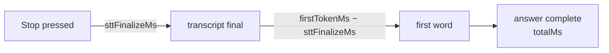

# Troubleshooting

A symptom-first runbook. Errors reach you two ways: as a `session:error` event
rendered in the error box (`role="alert"`), or inside a command's result
envelope (`{ ok: false, error: { code, message } }`,
`src-tauri/src/commands.rs:37-59`). Either way the `code` comes from one
closed set (`src-tauri/core/src/error.rs:13-27`) and the `message` is written
for the person on the call — it says what to do next wherever that is
knowable.

One code you will never see: `aborted`. It means *you* superseded or
cancelled the work, and the UI is required to stay silent about it
(`core/src/error.rs:71-74`; the emission gate that enforces it is
`core/src/session/machine.rs:175-183`).

---

## Error codes

### `no_stt_key`

**You see:** `No Deepgram API key set, so speech can't be transcribed. Open
Settings (gear icon) and add it.` (`core/src/error.rs:97-98`)

**What happened:** Record was pressed with no stored Deepgram key. Checked at
the command gate before anything opens (`src-tauri/src/commands.rs:118-119`)
and again inside the connector so no socket is ever dialed just to be
rejected (`core/src/stt/deepgram.rs:76-79`).

**Fix:** gear icon → paste the Deepgram key → Save. A key of only whitespace
counts as missing (`src-tauri/src/commands.rs:318-320`).

### `no_llm_key`

**You see:** `No {Anthropic|Groq} API key set, so answers can't be generated.
Open Settings (gear icon) and add it.` (`core/src/error.rs:102-104`)

**What happened:** the key for the **selected** provider is missing. If you
switched the provider to Groq, a saved Anthropic key does not count — the
check runs against `active_llm_key()` (`src-tauri/src/commands.rs:121-127`,
and per-provider before any dial: `core/src/llm/anthropic.rs` (`stream_answer`),
`core/src/llm/groq.rs:204-212`).

**Fix:** add the key for the provider named in the message, or switch the
provider back.

### `stt_connect`

**You see** one of:

- `Connecting to Deepgram timed out after 5 seconds. Check the API key and
  your network.` (`core/src/stt/deepgram.rs:211-221`)
- `Could not connect to Deepgram: {io error}. Check the API key and your
  network.` (`core/src/stt/deepgram.rs:205-209`)
- `Deepgram closed the connection before it was ready: close code 1008
  (DATA-xxxx …). Check the API key and your network.`
  (`core/src/stt/deepgram.rs:465-478`)
- `Could not reach the transcription service. Check your network and try
  again.` — the state machine's own 5 s connect cap
  (`core/src/session/machine.rs:504-514`, `core/src/session/mod.rs:135-136`)

**What happened:** the WebSocket never became usable. The subtle case is the
third one: **Deepgram rejects bad keys by accepting the WebSocket upgrade and
then closing the socket**, usually with no Error frame — close code 1008
carries a `DATA-xxxx` reason (bad key/request), 1011 a `NET-xxxx` server
fault. A successful handshake proves nothing about the key; only a first
frame from the server does, which is why any close before that first frame is
classified as a connect failure, not a mid-call drop
(`core/src/stt/deepgram.rs:253-260`).

**Fix:** a `DATA-xxxx` reason → re-paste the key. No close code at all →
network/firewall. The quoted code and reason are the only diagnostics
Deepgram offers on this path, so read them.

### `stt_error`

**You see** one of:

- `Lost the Deepgram connection: close code N (…)` / `: {io error}.`
  (`core/src/stt/deepgram.rs:465-486`)
- `Deepgram reported an error: {detail}` — a server Error frame mid-call
  (`core/src/stt/deepgram.rs:302-310`)
- `Deepgram reported an error while finalizing: {detail}` or `Lost the
  Deepgram connection while finalizing the transcript. Try again.` — a death
  during the CloseStream flush (`core/src/stt/deepgram.rs:370-381,419-427`)

**What happened:** the STT stream died *while the transcript still mattered*
(mid-recording or mid-finalize). Policy (§5.5): one honest error and the
session is torn down, because a silently truncated transcript answers the
wrong question (`core/src/session/machine.rs:550-556,610-617`). The flip
side: once the transcript is finalized the stream's job is done — a late
socket close cannot kill an answer that is already streaming
(`core/src/session/machine.rs:646-649`). So if you get `stt_error` while an
answer was painting, the death happened *before* finalize completed, not
after.

**Fix:** press Record again; the session is gone. If it repeats, it is your
network to Deepgram, not the app.

### `stt_timeout`

**You see:** `Timed out waiting for the final transcript. Try again.`
(`core/src/session/machine.rs:628-641`)

**What happened:** Stop was pressed, CloseStream went out, and Deepgram did
not finish flushing its tail within the 5 s cap
(`core/src/session/mod.rs:133-134`). Distinct from `stt_error` on purpose —
this is "the flush hung", not "the socket died" — so you debug the right
stage.

### `no_speech`

**You see:** `No speech detected in the recording. Make sure call audio is
playing.` (`core/src/error.rs:99-100`, raised at
`core/src/session/machine.rs:651-657`)

**What happened:** the finalized transcript trimmed to nothing, and the core
refuses to send an empty prompt to the LLM (§5.7). The app records
**loopback** — what comes out of your default *playback* device — not the
microphone (`core/src/audio/capture.rs:1-9`). So the usual causes:

- nothing was actually playing through the speakers (the other person was
  silent, or you recorded your own thinking pause),
- call audio is routed to a device that is **not** the Windows default output
  (headset vs. speakers),
- the call app's output volume is near zero.

A dead level meter during the recording is the early warning for the same
problem — see [Dead level meter](#dead-level-meter-while-recording).

What this is deliberately NOT anymore: a slow Deepgram dial. A stop that
lands while the WebSocket is still connecting now waits the dial out and
flushes the buffered question (`core/src/stt/deepgram.rs`, the dial loop),
and a dial that *fails* under a pending stop surfaces `stt_connect` instead
of an empty transcript. If you see `no_speech` on a slow network today, the
connect succeeded and the recording really carried no speech.

### `llm_auth`

**You see:**

- Anthropic: `Anthropic rejected the API key (401). Check it in Settings.` or
  `Anthropic refused the request (403): this API key is not allowed to use
  the model. Check it in Settings.` (`core/src/llm/anthropic.rs`, `map_status`)
- Groq: `Groq rejected the API key (401|403). Check it in Settings.` — the
  message reports the *actual* status (`core/src/llm/groq.rs:252-255`)

**What happened:** the provider heard the request and refused the
credentials. Never retried — the server said no, and it will say no again
(`core/src/llm/retry.rs:8-13`).

**Fix:** 401 → the key is wrong; re-paste it. 403 → the key is valid but not
entitled to the model (organization limits, expired plan).

### `llm_rate_limit`

**You see:** `Anthropic rate limit hit (429). Wait a moment, or check your
credit balance.` (`core/src/llm/anthropic.rs`, `map_status`) or `Groq rate limit
hit (429). Wait a moment before asking again.` (`core/src/llm/groq.rs:256-259`)

**What happened:** 429 from the provider. On Anthropic this is also what an
exhausted credit balance looks like — hence the message.

### `llm_http`

The catch-all for "the provider or the pipe failed". Variants and their
meanings:

| Message | Raised at | What it means |
|---|---|---|
| `Could not reach Anthropic|Groq. Check your internet connection.` | `anthropic.rs:35` + `stream_once` / `groq.rs:33,94-100` | The dial never completed. This message is in the retry predicate — it was already retried once before you saw it (the `with_retry_once` call in `stream_answer`). |
| `The connection … dropped while the answer was streaming. Try again.` | `anthropic.rs:36-37` + `stream_once` / `groq.rs:34-35,129-136` | Mid-stream drop. Retried only if no delta had reached the UI yet — a retry after painted text would concatenate two answers (`core/src/llm/retry.rs:14-18`). Your partial answer is kept. |
| `Anthropic is overloaded (529). Try again in a moment.` | `anthropic.rs`, `map_status` | Anthropic-side overload. Not your setup. |
| `Groq returned 404 for model "openai/gpt-oss-120b" — the model may have been retired — update the pinned model constant.` | `groq.rs:262-267` | Groq retires models on short notice. The fix is editing `GROQ_MODEL` (`core/src/llm/groq.rs:27`) — the error says so precisely because nobody remembers this under pressure. |
| `Groq is unavailable (HTTP 5xx). Try again in a moment.` | `groq.rs:268-271` | Groq-side outage. |
| `Anthropic|Groq returned HTTP N: {body snippet}` | `anthropic.rs` `map_status` / `groq.rs:272-276` | Anything else; the snippet (≤300 chars, `groq.rs:282-296`) is your only clue. |
| `… returned an empty response …` | `anthropic.rs:187-196` / `groq.rs:150-158` | HTTP 200 with zero SSE events — a broken response, refused rather than rendered as the model silently saying nothing. |
| `Anthropic reported an error mid-stream: {detail}` | `anthropic.rs:230-238` | The SSE stream itself carried an error event. |

### `llm_first_token_timeout`

**You see:** `The model did not start answering in time. Try again.`
(`core/src/session/machine.rs:717-727`)

**What happened:** 10 s elapsed after Stop with no first delta
(`core/src/session/mod.rs:137-138`). The timer is disarmed by the first
delta; once tokens flow only the 60 s total cap applies
(`core/src/session/machine.rs:708-716`). Deltas that race in after the
timeout fired paint nothing (`core/src/session/machine.rs:456-466`).

### `llm_timeout`

**You see:** `The answer took too long and was stopped. Try again.`
(`core/src/session/machine.rs:729-739`)

**What happened:** 60 s total elapsed. Whatever streamed before the cap stays
in the panel — an error during a streaming answer keeps the partial (§9).

### `internal`

Free-form messages for everything without its own code. The ones worth
recognizing:

- `No audio playback device is active, so call audio can't be captured.
  Enable a speaker or headphone output in Windows sound settings and try
  again.` (`core/src/audio/capture.rs:24-25`) — no default output device
  exists, or it died mid-recording.
- `The default playback device changed to "X" while recording, so call audio
  is no longer being captured. Press Record to capture the new device.`
  (`core/src/audio/capture.rs:276-281`) — you plugged in a headset
  mid-recording. WASAPI keeps capturing the *original* device after the
  default moves; the watcher polls every 2 s and surfaces this once
  (`core/src/audio/capture.rs:218,261-286`). Device errors are phase-aware:
  after Stop was pressed they are ignored, so a Bluetooth dropout cannot kill
  an answer already streaming (`core/src/session/machine.rs:353-390`).
- `Stop not taken: that session is unknown, already stopping, or already
  ended. No further events will arrive for it.`
  (`src-tauri/src/commands.rs:204-209`) — the stop contract's return value
  (§4/§5.3). You should never see this rendered; the UI uses it to leave
  "Finalizing…" (`src/state/useSession.ts:89-92`).
- `Could not save settings: {io error}` (`core/src/store/settings.rs:97-100`)
  — the atomic write failed (full disk, locked file). Memory still matches
  disk: nothing was half-saved.

---

## Silent symptoms

### Dead level meter while recording

The meter's only input is `audio:level`, emitted exactly when a frame is
accepted by the live session (`core/src/session/machine.rs:396-411`). Work
through the causes in order:

1. **Silence is silence.** RMS of a silent call is genuinely 0
   (`core/src/audio/mod.rs`, `rms_of_silence_is_zero`). If nobody is
   speaking, a dead meter is correct.
2. **The default device moved.** The watcher polls the default output
   device's identity every 2 s and raises one error when it changes
   (`core/src/audio/capture.rs:261-286`). If the meter died and *no* error
   appeared within a couple of seconds, the device did not move — keep going.
   (The watcher deliberately stays silent when the default *disappears*
   entirely: the stream's own error callback owns that report, and
   double-reporting reads as a crash loop —
   `core/src/audio/capture.rs:220-226`.)
3. **Audio is on a non-default device.** Loopback captures the default
   *render* device (`core/src/audio/capture.rs:131-141`). If Zoom outputs to
   "Headset" but Windows' default is "Speakers", the app records silence from
   the speakers. Make the device carrying call audio the Windows default.
4. **Surround downmix.** On a 5.1/7.1 default device only FL, FR and FC are
   mixed — the channels where dialog lives; LFE and surrounds are excluded
   because an equal average over six channels divides the voice by 6
   (`core/src/audio/resample.rs:98-120`, pinned by
   `surround_downmix_uses_the_speech_channels_not_all_of_them`,
   `resample.rs:239-265`). Content panned *only* to rear channels mixes to
   zero. If your audio setup does something exotic with channel routing,
   switch the default to a stereo endpoint.
5. **The capture never installed.** A Record press superseded during the
   ~100 ms WASAPI open stops its own capture instead of installing over the
   winner (`src-tauri/src/commands.rs:155-170`). Transient by construction —
   the *winning* press has its own capture.
6. **Frames route only to the live, not-yet-stopped session.** After Stop,
   frames (and their level events) are dropped by design — they would race
   the CloseStream flush (`core/src/session/machine.rs:392-396`). A meter
   that freezes the instant you press Stop is correct behavior.

### Window opens centered instead of where you left it

Centering is the sanitizer's *deliberate* verdict: the saved position is
honored only when it can be proven visible right now
(`core/src/store/bounds.rs:81-117`). The rules, each of which can eat a
position:

- **The 40 px rule:** at least 40 px of the window must land on some
  display's work area on *both* axes — enough to grab the ~32 px title bar
  and drag it back (`core/src/store/bounds.rs:19-22,107-110`). 39 px fails.
- **Both axes on the same display:** an L-shaped monitor arrangement cannot
  satisfy one axis per monitor (`bounds.rs:199-206` test).
- **Judged at the clamped size:** size is clamped up to the 380×520 minimum
  *first*, and visibility is judged at that size (`bounds.rs:76-80`).
- **Work area excludes the taskbar:** a position entirely over the taskbar
  strip is not visible (`bounds.rs:257-263` test).
- **Corrupt values drop the whole geometry**, not one field — NaN, ∞, 1e300
  anywhere means full fallback (`bounds.rs:87-99`).
- **Monitor enumeration failed:** an empty display list can prove nothing, so
  it centers (`src-tauri/src/window.rs:43-63`, `bounds.rs:241-247`).
- Negative coordinates are *valid* (a monitor left of primary) — that is not
  one of the failure causes (`bounds.rs:161-167`).

If the position is being *saved* wrong rather than restored wrong:

- **The minimized-save guard:** a minimized window measures at
  (-32000,-32000); saving that would clobber real geometry, so a minimized
  window contributes nothing and the last debounced value is used instead
  (`src-tauri/src/window.rs:65-72`).
- **Inner size on purpose:** restore applies through `set_size` = inner size,
  so the save must record inner size too — saving the outer rect would grow
  the window by the decoration size (~16×39 px) on every launch, forever
  (`src-tauri/src/window.rs:73-78`).
- Saves are debounced 500 ms and flushed on both close paths
  (`src-tauri/src/window.rs:132-141`); a kill mid-drag keeps the last
  debounced value.

### Hotkey chip missing vs. the "taken" notice

Two different states that look similar:

- **Chip missing, no notice:** the accelerator is empty — you disabled the
  shortcut. Empty means disabled and must not spring back to the default
  (`src-tauri/src/hotkey.rs:36-41`, `core/src/store/settings.rs:87-92`).
  A whitespace-only hotkey normalizes to empty on save.
- **Chip missing, notice shown** (`"<hotkey> is already taken by another app,
  so the shortcut is off — record from this window, or pick a different one
  in Settings."`): registration was *attempted and failed*. Registration is
  honest: parse failures and OS rejection (another app owns the combo) both
  land as `registered: false` rather than advertising a dead key
  (`src-tauri/src/hotkey.rs:43-56`). The notice renders only when the
  accelerator is non-empty AND unregistered — accusing another app of
  stealing a nameless key would be a false claim
  (`src/views/MainView.tsx:133-142`).

Also remember the hotkey is **ignored while Settings is open** — you may be
typing the hotkey itself into the hotkey field (`src/App.tsx:11-45`, the
gated bridge wrapper). If the hotkey "stops working" with Settings open, that
is the feature.

### Answers slower than ~1 s

Start with the latency chip's hover tooltip
(`src/format.ts:68-70`, rendered at `src/components/AnswerPanel.tsx:183-185`):

> `First word N ms after Stop · transcript finalized N ms · full answer X.X s`

Both numbers count from the instant Stop was requested
(`core/src/session/mod.rs:23-34`). Read them as a two-stage budget:

- **`sttFinalizeMs` is large (≫300 ms):** the Deepgram tail flush is the
  bottleneck — network to Deepgram, or a flush limping toward the 5 s cap.
  Nothing LLM-side will help. (`0` means a typed Ask — there was no STT
  stage; `core/src/session/machine.rs:275-277`.)
- **`firstTokenMs − sttFinalizeMs` is large:** the LLM leg is slow. Check in
  order:
  1. **Was the pre-warm defeated?** Warming fires on Record, on Ask, and on
     Stop (`core/src/session/machine.rs:229-231,262-266,307`) but is
     throttled to one warm per origin per 2 s
     (`core/src/llm/warm.rs:34,50-66`) — rapid-fire supersession can land a
     request on a colder connection than usual. Also: the warm only works
     because every request rides the one shared `reqwest::Client`
     (`core/src/llm/http.rs:5-12`) with a 120 s pool idle timeout
     (`http.rs:24`); a recording longer than that can outlive the warmed
     socket from Record time — the Stop-time warm exists to re-cover exactly
     this.
  2. **Provider choice.** Groq's gpt-oss is a reasoning model; the app
     already sends `reasoning_effort: "low"` and `include_reasoning: false`
     (`core/src/llm/groq.rs:61-67`), but first-word behavior still differs
     between providers — flip the provider and compare.
  3. **Prompt size.** The whole resume + JD rides every request. The
     Anthropic cache-split means a style flip never invalidates the cached
     profile — but honesty: below Haiku's 4096-token minimum the
     `cache_control` marker is a silent no-op, and it only starts paying at
     roughly 16 K+ characters of profile
     (`core/src/llm/anthropic.rs`, `request_body`).
     `usage.cache_read_input_tokens` is parsed and exposed as the ground
     truth (`anthropic.rs`, `last_cache_read_input_tokens` + the usage parse
     in `apply_event`).
- **`firstTokenMs == totalMs`:** the provider returned a complete answer
  without ever streaming a delta; the metric reports total rather than lying
  with 0 (`core/src/session/mod.rs:36-49`).

One thing that is *never* the cause: a retry after an HTTP error status —
those are not retried at all (`core/src/llm/retry.rs:8-13`). A silent retry
happens only for a connection-level failure before any delta, so it can cost
you at most one extra dial (`core/src/llm/anthropic.rs`, the `is_retryable`
closure in `stream_answer`).

### Transcript missing its final words

This was a real bug and is now fixed: frames captured between the socket
pump's last poll and the Stop are flushed to the wire **before** CloseStream
goes out (`core/src/stt/deepgram.rs:334-345`), pinned by
`audio_queued_at_stop_is_flushed_before_close_stream`
(`deepgram.rs:1080-1119`). CloseStream then makes the server flush its
smart_format hold-back (numbers, dates held until it is sure of them —
`deepgram.rs:346-361`).

If it recurs, suspects in order of likelihood:

1. **The drain changed.** Anything that breaks out of the drain before the
   `audio_rx.try_recv()` sweep, or that gates finalize-phase errors on
   `close_requested` instead of `aborted` only, re-opens the exact truncation
   §5.5 exists to prevent (`deepgram.rs:415-445` documents why the gates
   differ).
2. **The finalize select ordering.** The finalize loop is `biased` with the
   STT channel polled before the finalize future, so a queued death always
   beats a truncated transcript resolving in the same instant
   (`core/src/session/machine.rs:594-604`). An "optimization" that removes
   `biased` makes the truncated text win half the time.
3. **Words spoken after Stop.** Frames arriving after Stop was requested are
   dropped *by design* — they would race the CloseStream flush
   (`core/src/session/machine.rs:392-396`). Words said after you pressed the
   button were never going to be in the transcript.
4. **The frame queue.** The capture-to-forwarder channel holds ~4 s of frames
   (`core/src/audio/capture.rs:27-30`); a wedged consumer drops frames rather
   than stalling the audio engine. This loses mid-recording audio, not
   specifically the tail — but it is the only other place frames can vanish.

### crash.log

**Location:** `%APPDATA%\com.aicallhelper.app\crash.log` — the app data dir
resolved at startup (`src-tauri/src/lib.rs:42-46`; identifier from
`src-tauri/tauri.conf.json:5`).

**Format:** one line per panic —
`[YYYY-MM-DDTHH:MM:SSZ] panic at file:line:col: message`
(`src-tauri/src/logging.rs:34-38`). Timestamps are UTC on purpose
(`logging.rs:58-60`).

**How to read it:**

- A line here usually does **not** mean the app died. Answer pipelines run in
  isolated tokio tasks; under unwinding a panic kills that one task, the hook
  logs it, and the process survives — the release profile deliberately keeps
  unwind semantics instead of `panic = "abort"`
  (`src-tauri/src/logging.rs:17-21`, `src-tauri/Cargo.toml:44-52`). The
  visible symptom is one failed answer.
- The `file:line` is a real source location in this repo or a dependency —
  that is your starting point, not the message text.
- The log carries only the timestamp, location, and the developer-authored
  panic message: no keys, no resume text, no transcripts, ever
  (`logging.rs:3-7`).
- A log write that itself fails is silently dropped — a crash log must not
  turn one crash into two (`logging.rs:39-43`).
