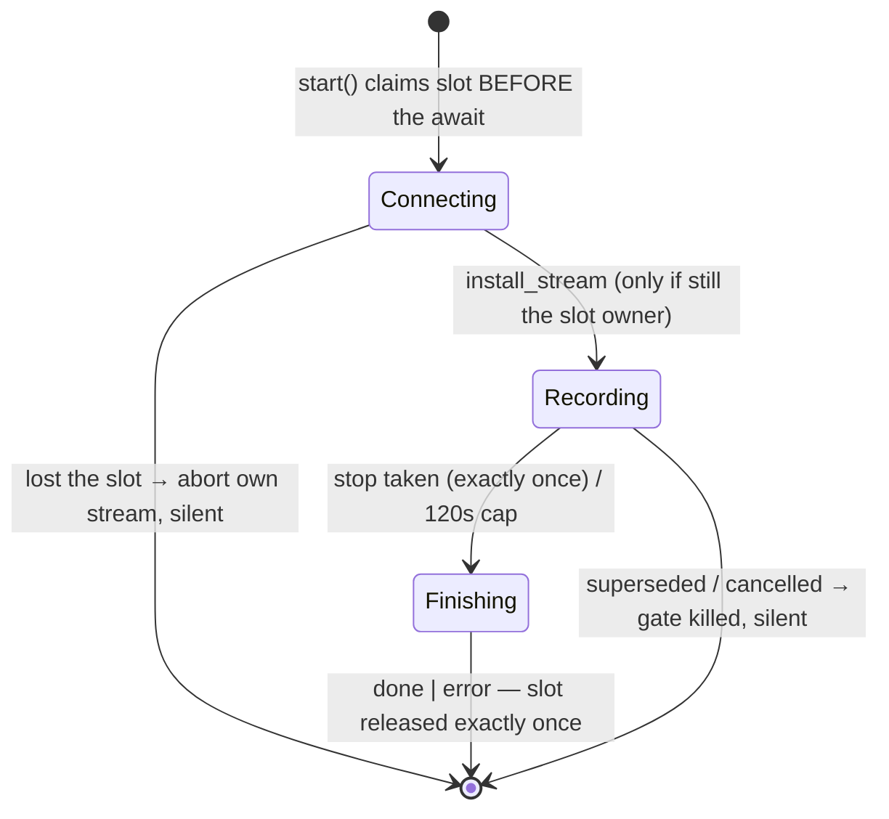

# ADR 002 — One live session slot + supersession, not a session queue

**Status**: accepted

## Context

During a live call the only question that matters is the newest one. If the
user presses Record while an answer is still streaming, they are saying
"forget that, this" — a queue that dutifully finished the old answer and then
started the new recording would be answering questions the user already
abandoned, in order, late.

The hard part is not the policy, it is the races. STT connect is a network
round-trip, so "the active session" is ambiguous exactly when the user is
mashing Record. v2's worst bugs lived here: a superseded session's `done`
repainting an answer the user abandoned, a losing connect installing itself
over the winner and swallowing its audio, the socket death caused by our own
abort being reported as an error (machine.rs module docs,
`src-tauri/core/src/session/machine.rs:5-20`).

## Decision

The session registry is `Mutex<Option<Active>>` — one slot, not a map
(`machine.rs:36-44`). Encoding "one live pipeline" in the type means
supersession cannot be forgotten on any code path:

- `start`/`ask` **replace** the slot and tear down whatever was there
  (`machine.rs:216-226`, `293-305`; teardown order at `machine.rs:106-117` —
  gate first, so nothing the teardown provokes reaches the UI).
- **Latest-start-wins** (SPEC §5.2): the slot is claimed *before* the connect
  await; a connect that resolves after losing discovers it via
  `install_stream` returning false and tears down its own stream, silently
  (`machine.rs:128-140`, `517-523`).
- **Slot ownership is the permission to speak.** Terminal events go through
  `release_if_current`/`fail`/`complete` (`machine.rs:156-193`), so a
  superseded session's `done` or its abort-caused socket death emits nothing,
  and the slot is released exactly once (§5.11).
- The same rule is repeated at the shell layer for the loopback capture swap:
  a capture that finishes opening after its session lost must not install
  itself over the winner's (`src-tauri/src/commands.rs:155-169`, backed by
  `SessionManager::is_active`, `machine.rs:344-350`).

## Consequences

- Supersession is safe by construction: there is no path that ends a session
  without going through the slot-ownership helpers, and no path that lets a
  loser emit.
- The frontend mirrors the shape with attempt keys and id adoption
  (`src/state/useSession.ts:44-77`, `src/state/reducer.ts:157-160`), giving
  two independent layers of stale-drop (ADR 011).
- No queue semantics to specify, persist, or explain in the UI.

Costs, honestly:

- Every terminal path — and there are many: done, six kinds of error, cancel,
  supersession, device death — must route through the same helpers. A new exit
  path added carelessly is a slot leak; the §5 test suite is what keeps this
  honest.
- Abort-caused failures need active suppression (the `Gate`,
  `machine.rs:79-104`): tearing a session down *causes* socket deaths that
  would otherwise be reported as errors.
- One-at-a-time means the user cannot record the next question while an
  answer streams *and keep* that answer streaming. Accepted: pressing Record
  during an answer means they stopped caring about it.

## If revisited

If the product ever wanted true parallelism (say, a background "second
opinion" answer), the slot becomes a map keyed by `SessionId` and "supersede"
becomes one policy among several. The id-gated emission and the frontend
stale-drop would carry over unchanged — they are what make *any* multiplicity
policy safe, not just this one.
