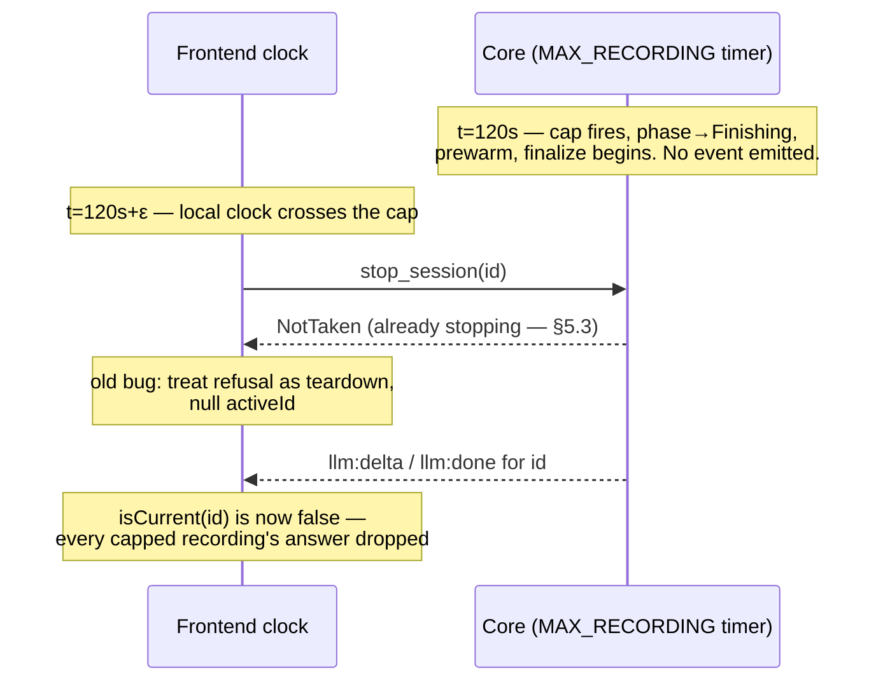

# ADR 012 — Core-authoritative timeouts: the frontend never enforces a deadline the core also enforces

**Status**: accepted

## Context

Two clocks enforcing one deadline is a race, and this codebase paid to learn
it. The 120 s recording cap (SPEC §3) was once effectively enforced twice:
the core auto-stops at its own timer, and the frontend's mm:ss clock also
crossed 120 s and reacted. The failure, fixed 2026-08-13 in the audited fix
pass:

The core's timer is armed when recording starts (`machine.rs:526-527`) and
provably fires first — the frontend's clock starts later and, worse, WebView2
**throttles timers in background windows**, so during the global-hotkey flow
(window minimized) the frontend clock can lag the core's cap by *minutes*
(`src/state/useSession.ts:178-187`). The frontend cannot be a deadline
authority; it can barely be a stopwatch.

## Decision

**Every deadline is enforced in the core, and only in the core**
(SPEC §3: "all enforced in the core"): STT connect 5 s, STT finalize 5 s, LLM
first token 10 s, LLM total 60 s, recording cap 120 s — one `limits` module
(`src-tauri/core/src/session/mod.rs:129-146`), applied inside the state
machine where each timeout can abort the in-flight work and report its
specific code (`machine.rs:495`, `590-643`, `695-741`).

The 120 s cap behaves exactly like a user stop: flip to Finishing, prewarm,
finalize, answer normally (`machine.rs:559-584`) — and deliberately emits **no
event for the auto-stop itself**; the answer events are the announcement.

The frontend's role is confined to display, with two rules (the fix):

1. **The local cap transition is purely local**: at 120 s of wall-clock ticks
   it flips to `finalizing`, **keeps `activeId`/`liveKey`**, and issues no
   stop — because the core has already stopped, and a `stop_session` now
   returns NotTaken, and reacting to that refusal is the double-stop race that
   dropped every capped recording's answer
   (`src/state/reducer.ts:260-277`, `src/state/useSession.ts:183-187`).
2. **Belt and braces for a lagging clock**: `llm:delta`/`llm:done` arriving
   while the UI still thinks it is `recording` are accepted for the current
   id — answer events can only exist after recording ended, so they *are* the
   authoritative "the core capped it" signal (`reducer.ts:297-306`,
   `319-325`).

The timer itself accumulates `performance.now()` deltas, not fire counts, so
WebView2 throttling slows its updates without corrupting the elapsed total
(`useSession.ts:188-197`).

## Consequences

- Exactly one deadline authority. The frontend clock can be wrong by minutes
  and nothing breaks — the status line updates late, the answer still lands.
- A capped recording answers normally, which is the §3 contract ("auto-stop,
  then answer normally"), and the latched `hitRecordingCap` shows "Reached the
  120s limit — answering now" through finalizing/answering (SPEC §9).
- The same principle keeps every other timeout honest: the shared HTTP client
  deliberately has **no** client-wide timeout (`http.rs:45-49`) precisely so
  the core's per-stage deadlines are the only ones in play.

Costs, honestly:

- The frontend must *trust* the core acted at 120 s without any event saying
  so — the inference lives in comments (`reducer.ts:264-276`) and would be
  invisible without them.
- Accepting answer events from the `recording` state reads as a state-machine
  violation until you know why; it is documented at the acceptance site for
  exactly that reason.
- The status line at the cap is driven by the *local* clock, so in a
  throttled background window it can show "Recording…" for a while after the
  core already moved on. Cosmetic, and the honest price of one authority.

## If revisited

If the UI ever needs to *know* about the auto-stop rather than infer it, the
right change is a core-emitted event (e.g. a `capped: true` flag on the next
`stt:partial` or a dedicated event) — never a second frontend timer. The rule
generalizes: when two components could enforce a deadline, the one that owns
the work owns the clock, and the other one only ever displays.
