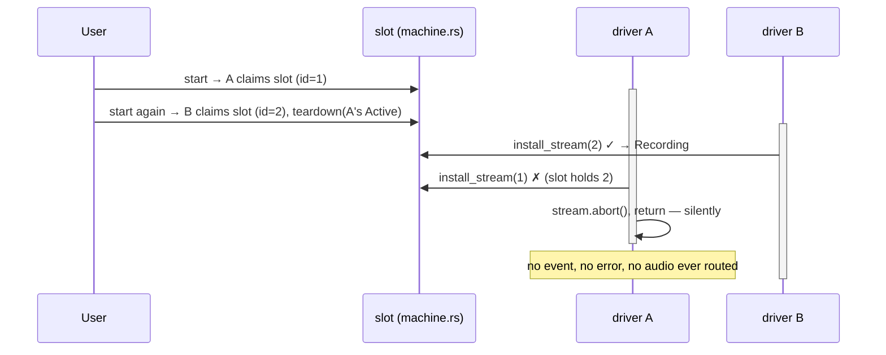

# 02 — Racing the network: latest-start-wins and claim-before-await

**Concept.** Any time you `await` a network round-trip and then act on the
result, you have written a race: the world can change during the await, and
your continuation runs against a world that may no longer want it. The classic
victim is the autocomplete box — request per keystroke, responses out of
order, stale result overwrites fresh one. The classic wrong fix is checking
"am I still wanted?" when the response *arrives*, using state that the racing
party updates at some unrelated time. The right shape is:

1. **Claim before the await.** Publish "I am the newest" synchronously, before
   any suspension point.
2. **Discover loss at install time.** When the await resolves, re-check the
   claim *at the moment you try to install the result* — atomically, against
   the same store the claim lives in.
3. **The loser cleans up its own mess.** It opened a socket; it closes it. It
   does not report, install, or emit — silence is the contract.

**Where this repo stakes its life on it.** §5.2: STT connect is a network
round-trip, and the user can press Record again while one is connecting. In
v2, "the loser once installed itself over the winner and swallowed its audio"
(machine.rs:1275-1277). The fix runs the same pattern at two layers.

## Core: the slot is claimed before the connect

`SessionManager::start` (machine.rs:210-237) claims the slot *synchronously* —
`replace` happens before the driver task even spawns, so by the time any
network I/O begins, the world already knows who is newest:

```rust
// machine.rs:216-226 (abridged)
let previous = self.inner.replace(Active {
    id,
    phase: Phase::Connecting,
    ...
});
if let Some(previous) = previous {
    teardown(previous);
}
```

The driver then connects — and deliberately does **not** watch for its own
cancellation during the dial:

```rust
// machine.rs:492-495
// Deliberately NOT racing the cancel token here: a superseded connect is
// allowed to finish its round-trip so that it can tear down the socket it
// opened. The loss is discovered at install time (§5.2).
let connected = tokio::time::timeout(limits::STT_CONNECT, deps.stt.connect(sink)).await;
```

That is a subtle, senior decision. Aborting the connect future at cancel time
would *leak the socket it was opening* — nobody would own the half-established
connection. Letting the round-trip finish means there is always exactly one
owner who can close it. The loss check happens at the only place it can be
atomic — installation into the shared slot:

```rust
// machine.rs:128-140
/// Install the freshly connected stream — but only if this session is
/// still the one in the slot (§5.2). A start that lost while connecting
/// gets `false` and must tear its own stream down.
fn install_stream(&self, id: SessionId, stream: Arc<dyn SttStream>) -> bool {
    let mut slot = self.slot.lock().unwrap();
    match slot.as_mut() {
        Some(active) if active.id == id && matches!(active.phase, Phase::Connecting) => {
            active.phase = Phase::Recording { stream };
            true
        }
        _ => false,
    }
}
```

```rust
// machine.rs:517-523
// Latest-start-wins (§5.2): if a newer start claimed the slot while we
// were connecting, this stream must die by our own hand, silently — it
// must never install itself over the winner or receive one frame of audio.
if !inner.install_stream(id, stream.clone()) {
    stream.abort();
    return;
}
```

Two conditions guard the install, and both matter. `active.id == id` is the
supersession check. `matches!(active.phase, Phase::Connecting)` guards a
different race: if this session was somehow already past Connecting, a second
install must not clobber a live stream.

## Frontend: the same pattern with a string instead of a mutex

`useSession.ts` has the identical problem one layer up: `bridge.startSession()`
is an IPC round-trip, and the user can abort or supersede while it is in
flight. Same shape — claim (`attemptRef`), await, re-check at install:

```ts
// src/state/useSession.ts:60-71 (abridged)
keyCounter.current += 1;
const key = `attempt-${keyCounter.current}`;
attemptRef.current = key;           // claim, synchronously
dispatch({ type: 'record/start', key });
const env = await bridge.startSession();
if (attemptRef.current !== key) {
  // The user aborted or superseded while this call was in flight; a
  // session that started anyway is an orphan and must be cancelled.
  if (env.ok) bridge.cancelSession(env.value);
  return;
}
```

Note the loser's cleanup duty again: the core *did* start a session for this
call — someone must cancel that orphan, and the only party who knows its id is
the loser holding the resolved envelope. Abort-while-starting works by
invalidating the claim: `attemptRef.current = null` (useSession.ts:102-104),
which is "what makes the eventual startSession resolution cancel instead of
adopt."

The reducer enforces the same rule a third time, purely:
`record/started` is ignored unless `state.ui === 'starting' &&
state.liveKey === action.key` (reducer.ts:189-198) — "a resolution from a
superseded/aborted attempt must not resurrect it."



## The tests that pin it

- `double_record_while_first_is_connecting_latest_start_wins`
  (machine.rs:1273-1305) — the second press wins *even though the first
  connect resolves later*; the loser is aborted, receives no audio
  (`a_stream.frames().is_empty()`), and emits nothing, "not even aborted".
- `start_supersedes_live_recording_and_its_late_events_are_dropped`
  (machine.rs:1214-1245) — the already-installed variant: late transcript and
  the abort-caused socket death are both dropped.
- `is_active_tracks_slot_ownership_across_supersession_and_completion` — the
  shell's `is_active` probe (machine.rs:345-350) answers "does this session
  still own the slot", which decides who gets the audio capture.
- Frontend: `ignores a resolution for a superseded attempt key`
  (reducer.test.ts) and `returns to idle silently and cancels the session if
  it starts anyway` (useSession.test.ts) — the orphan-cancel path.

## Exercises

**Reading 1.** The connect await *is* raced against one thing: a 5 s timeout
(machine.rs:495). Why is racing a timeout fine when racing the cancel token
was deliberately rejected?

<details><summary>Answer</summary>

Timeout and cancellation have different ownership consequences. On timeout,
the driver itself is still the one acting — it drops the connect future,
reports `SttConnect` through `fail()` (machine.rs:504-514), and owns the
cleanup; nothing is left half-owned because the same task that opened the dial
abandons it. Racing the *cancel token* would end the task while a competing
session is already running, leaving the in-flight socket with no owner to
close it. Also practically: a hung connect with no cap "is a Record button
that never answers and never fails" (`connect_timeout_surfaces_stt_connect`),
whereas cancellation already has a correct, slower path — finish the dial,
lose at install, abort your own stream.
</details>

**Reading 2.** In `double_record_while_first_is_connecting_latest_start_wins`,
the fake records streams in *connect-resolution* order, so `stream(0)` is B's
and `stream(1)` is A's (machine.rs:1290-1292). What real-world property of
this race does that inversion encode?

<details><summary>Answer</summary>

That "newest" is defined by *when the user acted*, not by *when the network
answered*. A's connect was dispatched first but resolves last (300 ms vs
50 ms scripted delay); any implementation that decides the winner by
resolution order — e.g. "last stream to install wins" — would pass a naive
test where the delays line up, and fail the user every time the older dial is
slower. The claim made before the await is what pins "newest" to the button
press.
</details>

**Break it.** In `install_stream` (machine.rs:131-140), drop both guard
conditions:

```rust
match slot.as_mut() {
    Some(active) => {
        active.phase = Phase::Recording { stream };
        true
    }
    _ => false,
}
```

Run `cargo test -p app-core double_record_while_first_is_connecting_latest_start_wins`.

It fails on `a_stream.aborted()`: A's connect resolves 250 ms after B
installed, the broken install happily overwrites B's live stream inside the
slot B owns, and A never tears itself down. The follow-on assertions show the
user-visible damage: `push_audio(b, ...)` now feeds A's stream (the id in the
slot is still B's, but the stream is A's), so B's frames land on a socket
bound to the wrong Deepgram connection — the "swallowed audio" bug this test
was purchased with. One `if` guard is all that separates the two worlds, which
is why the guard has a dedicated regression test rather than trust.
