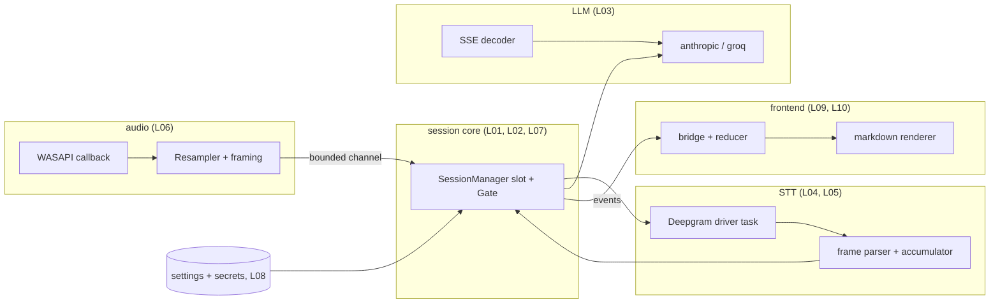

# Learn: a code-reading curriculum

Ten lessons that teach intermediate-to-senior systems concepts *through this
repo*. Each lesson takes one concept, shows where this codebase stakes its
correctness on it, quotes the real code, and names the tests that pin the
behavior. Every lesson ends with exercises: reading exercises (answers
included) and one **break it** exercise — a specific edit to make, the test
that catches it, and why that test exists.

The repo is small enough to actually read and hostile enough to be worth
reading: realtime audio, two streaming wire protocols, a race-heavy state
machine, untrusted input at three boundaries (settings file, provider frames,
model output), and a ~1 s latency promise that every timeout serves. The spec
is [`docs/SPEC.md`](../SPEC.md); lessons cite its § numbers the same way the
code does.

## How to use it

1. Read the lesson with the cited file open. Citations are `path:line` against
   the current tree — if a file has drifted, the named test is the stable
   anchor. Two path shorthands, used across all of `docs/`: `core/src/...`
   means `src-tauri/core/src/...` (the `app-core` crate), and `src/...` is the
   frontend at the repo root.
2. Run the named test before and after any break-it edit:

   ```sh
   # core lessons (from src-tauri/)
   cd src-tauri && cargo test -p app-core <test_name>

   # frontend lessons (from the repo root)
   npm test -- -t "<test name>"
   ```

3. Revert the break-it edit (`git checkout -- <file>`). Nothing in these
   lessons should ever be committed.

## The map



## Curriculum

Read in order — later lessons lean on the session machine vocabulary that 01
and 02 establish. If you want a gentler on-ramp, 03 and 04 are self-contained
pure-function lessons and can be read first.

| # | Lesson | Concept | Main files | Time |
|---|--------|---------|-----------|------|
| 01 | [Ownership-based concurrency](01-ownership-based-concurrency.md) | Exactly-once release as a type-system consequence, not a discipline | `core/src/session/machine.rs` | ~60 min |
| 02 | [Racing the network](02-racing-the-network.md) | Latest-start-wins: claim before the await, discover loss at install time | `machine.rs`, `src/state/useSession.ts` | ~45 min |
| 03 | [Streaming parsing under hostile chunking](03-sse-hostile-chunking.md) | Split-point invariance and the exhaustive cut-point test | `core/src/llm/sse.rs` | ~45 min |
| 04 | [The transcript accumulator](04-transcript-accumulator.md) | O(1) incremental state; strict typing of untrusted wire input | `core/src/stt/frame.rs` | ~40 min |
| 05 | [A single-owner socket task](05-single-owner-socket-task.md) | The single-writer principle; at-most-once error reporting made structural | `core/src/stt/deepgram.rs` | ~60 min |
| 06 | [Realtime audio constraints](06-realtime-audio-constraints.md) | What a realtime callback may not do; drift-free integer resampling | `core/src/audio/capture.rs`, `resample.rs` | ~60 min |
| 07 | [Timeouts as product design](07-timeouts-as-product-design.md) | Deadline budgets, disarm-on-progress, core-authoritative clocks (the 120 s cap bug) | `machine.rs`, `src/state/reducer.ts` | ~60 min |
| 08 | [Fail-closed secrets and untrusted config](08-fail-closed-secrets.md) | Prefix-dispatched decoding, per-field fallback, atomic writes | `core/src/store/secrets.rs`, `settings.rs` | ~50 min |
| 09 | [Rendering untrusted model output](09-rendering-untrusted-output.md) | Structural XSS safety; the streaming-vs-batch DOM invariant | `src/markdown/` | ~50 min |
| 10 | [The IPC seam](10-the-ipc-seam.md) | Envelopes over exceptions; stale-dropping; mirror, never re-enforce | `src/bridge.ts`, `src/state/reducer.ts` | ~50 min |

Total: roughly nine hours of close reading.

## Self-quiz: what each lesson prepares you to answer

Classic interview questions, one per lesson. If a lesson landed, you can
answer its question with a concrete mechanism from this repo instead of a
generality.

1. **(L01)** "N concurrent paths can finish a job — completion, error,
   timeout, cancellation, supersession. How do you guarantee cleanup runs
   exactly once?" — Answer with the one-slot `Mutex<Option<Active>>`,
   id-keyed release, and why `oneshot::Sender::send(self)` cannot be called
   twice.
2. **(L02)** "An autocomplete fires a request per keystroke; responses return
   out of order. How do you make sure only the latest result renders?" —
   Answer with claim-before-await and loss discovered at install time, not at
   response time.
3. **(L03)** "TCP hands you a byte stream, not messages. How do you write —
   and more importantly *test* — a parser that survives arbitrary
   fragmentation?" — Answer with the every-cut-point-equals-one-shot property
   test and the `pending_cr` state bit.
4. **(L04)** "Appending to a result inside a loop by re-joining everything —
   what's the complexity, and when does it matter?" — Answer with the
   committed-prefix accumulator vs the quadratic re-join at 10 messages/s;
   throw in literal-`true` checking of untrusted JSON as the bonus.
5. **(L05)** "Many producers, one socket. How do you serialize access without
   a lock, and how do you stop two failure paths from both reporting?" —
   Answer with the actor/single-writer task and "every report site returns
   from the driver".
6. **(L06)** "What operations are forbidden on a realtime audio callback (or
   a signal handler, or a UI thread), and how does data get off it?" — Answer
   with try_send on a bounded channel, drop-don't-block, and the RMS
   computation moved to the forwarder thread.
7. **(L07)** "How do you assign timeouts across a multi-stage pipeline, and
   where should the deadline live in a client-server split?" — Answer with
   the §3 budget measured from one captured stop instant, disarm-on-first-
   delta, and the 120 s cap bug (two clocks, one authority).
8. **(L08)** "How do you store secrets at rest on a client machine, and does
   your config parser fail open or fail closed?" — Answer with DPAPI +
   honest `plain:` marking, decode-by-stored-prefix, and per-field fallback
   vs whole-file defaulting.
9. **(L09)** "How do you prevent XSS when rendering user- or model-generated
   content?" — Answer with structural safety (every string is a text node,
   no attribute derived from content) versus sanitizer allowlists, and the
   streaming-prefix convergence invariant.
10. **(L10)** "Exceptions or result values across an API boundary? And what
    do you do with an event that arrives for a request the user already
    abandoned?" — Answer with the `{ok} | {error}` envelope, the stop
    took/not-took contract, and drop-don't-buffer for pre-adoption events.
